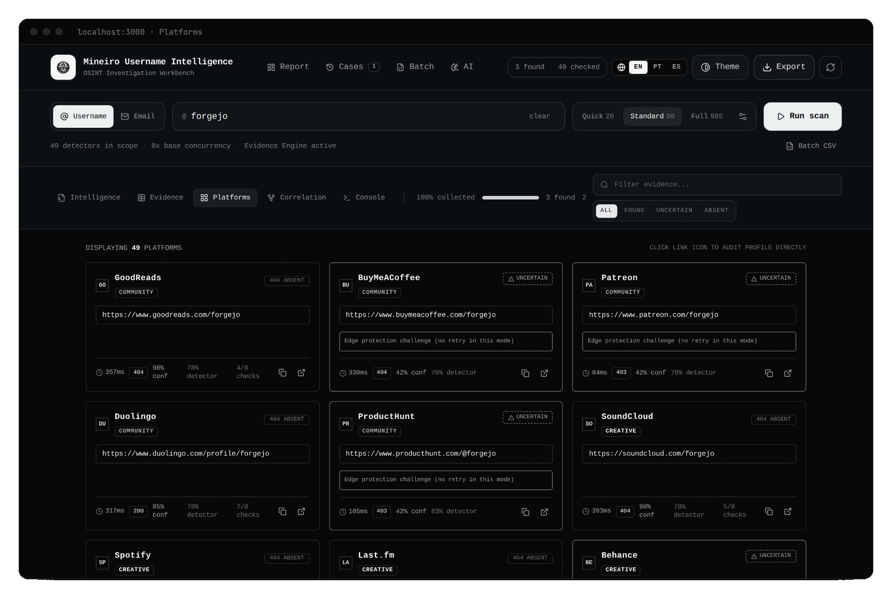
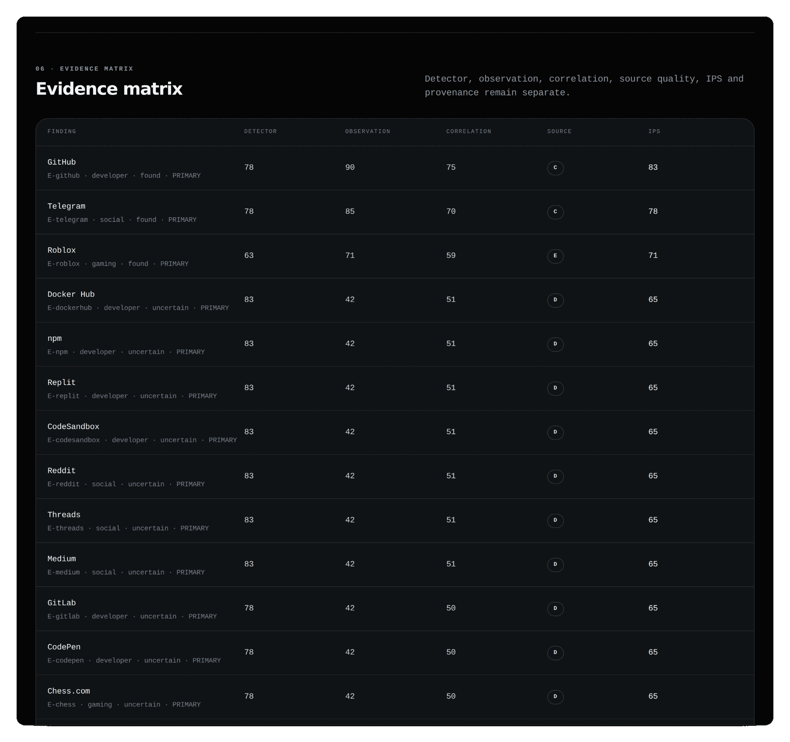

<p align="center">
  
</p>

<p align="center">
  <a href="https://github.com/Ridd1kulusC0d3r/Mineiro-OSINT-Extractor/actions/workflows/ci.yml"></a>
  
  
  
  
  
</p>

<p align="center">
  <a href="https://colab.research.google.com/github/Ridd1kulusC0d3r/Mineiro-OSINT-Extractor/blob/main/notebooks/Mineiro_Username_Intelligence_Colab.ipynb"><strong>▶ Open in Google Colab</strong></a>
  &nbsp;·&nbsp;
  <a href="#quick-start">Install</a>
  &nbsp;·&nbsp;
  <a href="docs/USER-GUIDE.md">User guide</a>
  &nbsp;·&nbsp;
  <a href="docs/README.md">Docs</a>
  &nbsp;·&nbsp;
  <a href="CHANGELOG.md">Changelog</a>
  &nbsp;·&nbsp;
  <a href="README.pt-BR.md">Português</a>
</p>

<p align="center">
  
</p>

<p align="center"><sub>A Standard scan of a public open-source handle: live progress, per-platform verdicts (absent / uncertain / found), the Evidence Engine and the correlation graph. Real UI, no mockups.</sub></p>

---

**Mineiro Username Intelligence** is an **OSINT Investigation Workbench**. It checks public surfaces associated with a username or e-mail and turns raw technical responses into a structured, auditable assessment.

It keeps apart four things that username tools usually blur together: **collection → evidence → correlation → assessment**. A `FOUND` is an observation. It is **not** proof of identity.

## At a glance

<table>
  <tr>
    <td valign="top" width="33%"><b>Evidence, not guesses</b><br><sub>8 logical checks per response. Each result carries a SHA-256 <code>evidenceHash</code>, a timestamp and the detector version.</sub></td>
    <td valign="top" width="33%"><b>Fewer false positives</b><br><sub>A differential baseline asks for a handle that cannot exist and discards “200 OK” pages that look the same.</sub></td>
    <td valign="top" width="33%"><b>Safe by construction</b><br><sub>Public IPs only (rebinding-safe), every redirect re-validated, rate limits. No CAPTCHA or login bypass.</sub></td>
  </tr>
  <tr>
    <td valign="top" width="33%"><b>Auditable reports</b><br><sub>HTML, JSON, Markdown and CSV from the UI, each with an integrity manifest (SHA-256). STIX 2.1 is available through the API.</sub></td>
    <td valign="top" width="33%"><b>Cautious correlation</b><br><sub>Similar usernames, shared domains and avatar hashes become <i>candidate</i> edges. A claim must cite observations.</sub></td>
    <td valign="top" width="33%"><b>Runs locally</b><br><sub><code>pip install</code>, Colab or from source. Optional SQLite store in your home directory. Investigations stay in your browser; the app sends only the probe requests, plus site-icon lookups (favicon services) and the AI copilot if you enable it. See <a href="docs/PRIVACIDADE-E-DADOS.md">privacy</a>.</sub></td>
  </tr>
</table>

## How it works

<p align="center">
  
</p>

## See it

**Start screen.** Search right where you land, pick a mode, try a public example. Paste a profile URL and it suggests the handle; learn how to read a verdict before the first scan:

<p align="center">
  
</p>

**Evidence ledger.** Every detector, its verdict, confidence and how many of the 8 checks passed:

<p align="center">
  
</p>

**Intelligence report.** Conclusions first; what is known, what is assessed, what is unknown:

<p align="center">
  
</p>

**Correlation graph.** Solid edges are observed; dashed edges are username-similarity candidates that need independent validation:

<p align="center">
  
</p>

<details>
<summary>More: platform cards, evidence matrix</summary>

<p align="center">
  
</p>
<p align="center">
  
</p>

</details>

## Why a `200 OK` is not a profile

Many sites answer `200 OK` with a "profile not found" page. Mineiro also requests a handle that cannot exist and only trusts a result that looks *different* from that control.

<p align="center">
  
</p>

## Quick start

<details open>
<summary><b>Option 1 · pip</b> (recommended)</summary>

```bash
pip install mineiro-osint     # not on PyPI yet? see "Install from a release" below
mineiro                       # opens http://127.0.0.1:3000
```

The package ships the full app (~1.3 MB). It uses your Node.js (>= 22.5) if present; otherwise it installs its own through `nodejs-wheel-binaries`, so there is nothing else to set up. It binds to `127.0.0.1` and stores data in `~/.mineiro`. Run `mineiro --check` for diagnostics.

**Install from a release** (before the first PyPI publication):

```bash
pip install https://github.com/Ridd1kulusC0d3r/Mineiro-OSINT-Extractor/releases/download/v1.7.0/mineiro_osint-1.7.0-py3-none-any.whl
```

</details>

<details>
<summary><b>Option 2 · Google Colab</b></summary>

[](https://colab.research.google.com/github/Ridd1kulusC0d3r/Mineiro-OSINT-Extractor/blob/main/notebooks/Mineiro_Username_Intelligence_Colab.ipynb)

The official notebook clones the repo, installs dependencies, validates the registry, starts the server and opens the UI through the Colab proxy. Nothing to install locally.

</details>

<details>
<summary><b>Option 3 · from source</b></summary>

Requires **Node.js 22+**.

```bash
git clone https://github.com/Ridd1kulusC0d3r/Mineiro-OSINT-Extractor.git
cd Mineiro-OSINT-Extractor
npm ci --no-audit --no-fund
npm run dev
```

Open `http://localhost:3000`. A guided setup is in [docs/GETTING-STARTED.md](docs/GETTING-STARTED.md), and Docker instructions are in [docs/DEPLOYMENT.md](docs/DEPLOYMENT.md).

</details>

> The in-depth documentation under `docs/` is currently in Portuguese. This README and the CHANGELOG are the English entry points.

## Scan modes

| Mode | Scope | Evidence Engine | Use for |
|---|---:|---:|---|
| Quick | Top 20 | no | fast checks and development |
| Standard | Top 50 | yes (with differential baseline) | normal investigations |
| Full | Whole scannable registry | progressive | broad coverage |

Full scan runs in two phases: fast discovery first, then deeper checks only on candidates that were found, uncertain or rate-limited. Protected endpoints stay inconclusive. Mineiro does not try to defeat CAPTCHAs or access controls.

## Reading a result

Do not use one score to answer different questions.

| Field | Answers |
|---|---|
| Detector Reliability | Is this site's rule usually dependable? |
| Observation Confidence | Was *this* query conclusive? |
| Correlation Confidence | Do the findings support a relation between accounts? |
| Source Quality | How strong is the public source observed? |
| IPS | Is this finding worth reviewing before the others? |

Full model: [docs/INTELLIGENCE-METHODOLOGY.md](docs/INTELLIGENCE-METHODOLOGY.md).

## What's in 1.7

- **Safer probing.** The server only probes URLs a registry detector can produce, resolves DNS through a guard that blocks private, loopback, link-local and cloud-metadata ranges, and re-validates every redirect hop. Rate limits, security headers and a `MINEIRO_PUBLIC=1` mode for shared deployments.
- **Fewer false positives.** Differential baseline and declarative detectors (`registry/detectors/*.json`) with canary handles and a weekly health check.
- **Auditable evidence.** `evidenceHash` (SHA-256), `collectedAt` and `detectorVersion` on every result.
- **Interoperable (API).** STIX 2.1 export and an optional SQLite store (Entity → Observation → Claim) are exposed through the local API (see [docs/CLI-E-API.md](docs/CLI-E-API.md)); the UI does not write to them yet.
- **More OSINT (API).** Username variants (Jaro-Winkler), pivot extraction with depth/budget limits, avatar perceptual hash, Wayback Machine timeline, Brazilian CNPJ lookup (company-level fields only).
- **`pip install`** and a reproducible, locked build.

See the [CHANGELOG](CHANGELOG.md) for details.

## Graph hunting, cases and diffs

- Similar usernames appear as candidate nodes and can be scanned straight from the graph; pivot scans run in the background and feed the same graph.
- Read-only local graph queries (`MATCH candidate=true AND similarity>=70`, `SHARED type=DOMAIN`, `PATH from=TARGET to=PROFILE`), with optional Neo4j/Cypher export. Guide: [docs/GRAPH-HUNTING.md](docs/GRAPH-HUNTING.md).
- Long-lived Cases (browser IndexedDB) with immutable snapshots and a Diff Intelligence view (`NEW`, `DISAPPEARED`, `CHANGED`, `UNCHANGED`, `CONFIDENCE_UP`, `CONFIDENCE_DOWN`). `DISAPPEARED` is a difference between collections, **not** proof that an account was deleted.

## Architecture

<p align="center">
  
</p>

Details: [ARCHITECTURE.md](ARCHITECTURE.md).

## Development

```bash
npm ci --no-audit --no-fund
npm test               # Vitest: evidence, baseline, SSRF guard, store
npm run check          # the full CI gate
npm run build:python   # stage the app inside the pip package
npm run detectors:health   # live canary check of declarative detectors
```

The README visuals are reproducible: `npm run assets:capture` (screenshots from a running instance) and `npm run assets:render` (banner, diagrams, framed screenshots). See [CONTRIBUTING.md](CONTRIBUTING.md) and [SECURITY.md](SECURITY.md).

## Principles

1. **Observation is not identity.**
2. **Inconclusive stays inconclusive.**
3. **Provenance must survive all the way to the report.**
4. **Contradictions deserve the same visibility as supporting evidence.**
5. **AI summarizes and prioritizes; it does not fabricate factual confidence.**
6. **Collecting more is not automatically investigating better.**

## Responsible use

Use only publicly accessible information, for a legitimate and authorized purpose. Respect applicable terms, rate limits, privacy and the law (including LGPD/GDPR).

The project provides no mechanism to bypass authentication, CAPTCHAs or access controls, and it does not score people.

## License and provenance

Original Mineiro code is MIT. The historical catalog has entries still under provenance audit; read [LICENSES_AND_PROVENANCE.md](LICENSES_AND_PROVENANCE.md) before reusing the dataset outside this project.

---

<p align="center"><sub><b>Mineiro Username Intelligence v1.7.0</b> · OSINT Investigation Workbench · evidence first · local reporting</sub></p>
