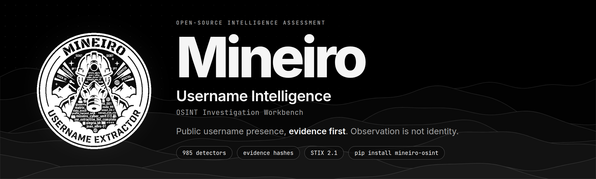
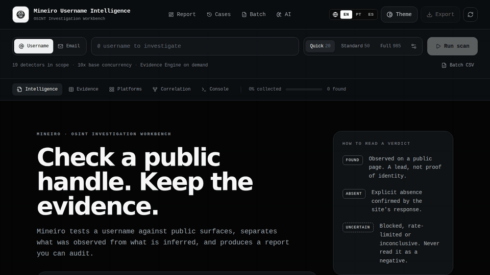
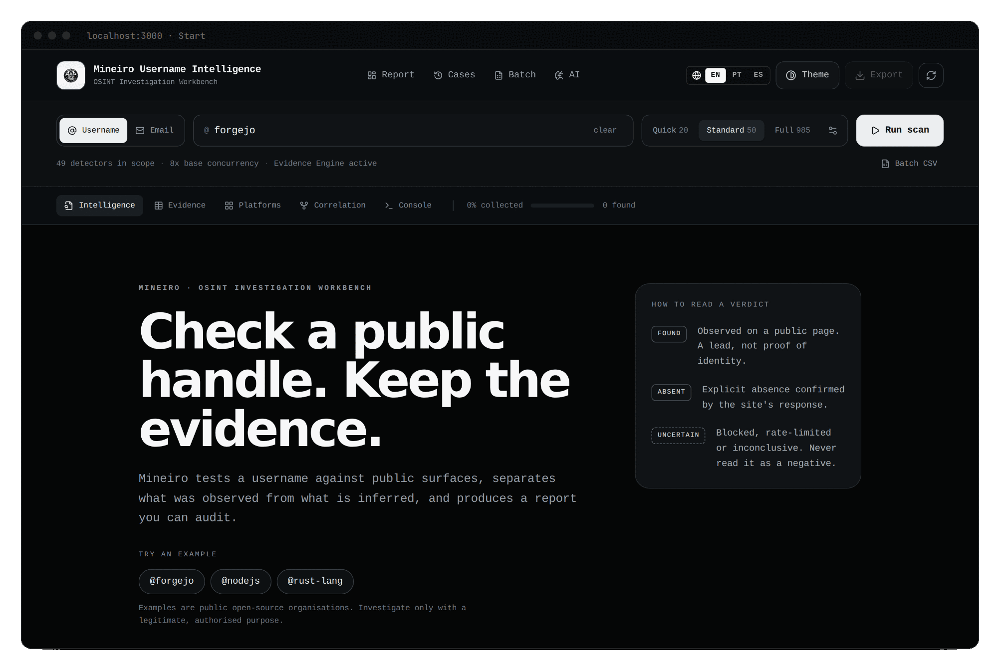
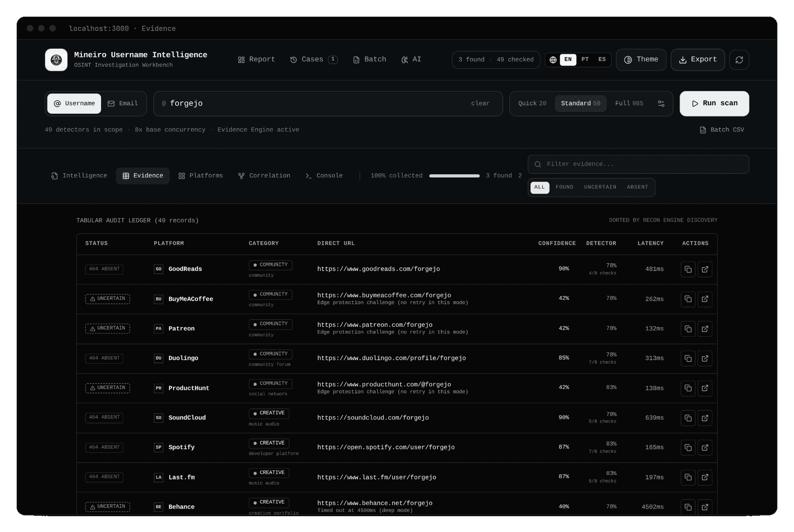
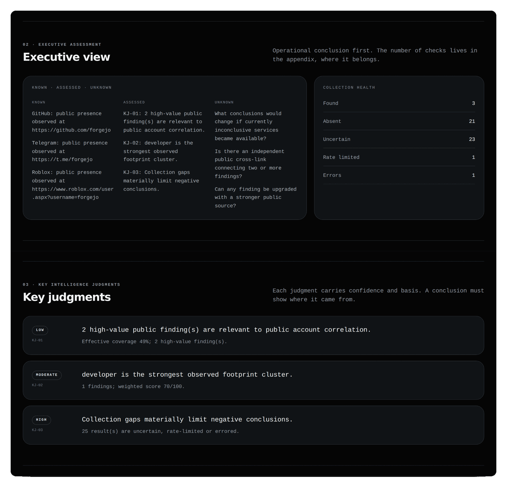
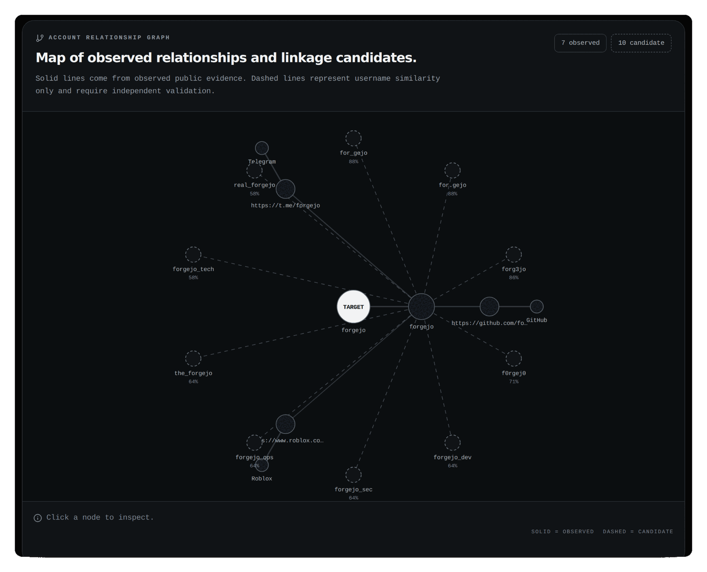
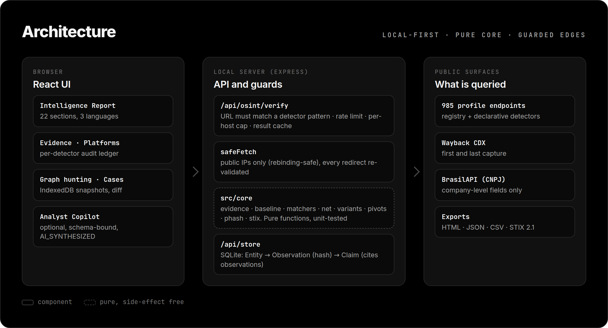

# Mineiro Username Intelligence

<p align="center">
  
</p>

<p align="center">
  <a href="https://github.com/Ridd1kulusC0d3r/Mineiro-OSINT-Extractor/actions/workflows/ci.yml"></a>
  
  
  
  
  
</p>

<p align="center">
  <a href="https://colab.research.google.com/github/Ridd1kulusC0d3r/Mineiro-OSINT-Extractor/blob/main/notebooks/Mineiro_Username_Intelligence_Colab.ipynb"><strong>▶ Abrir no Google Colab</strong></a>
  &nbsp;·&nbsp;
  <a href="docs/GETTING-STARTED.md">Instalar localmente</a>
  &nbsp;·&nbsp;
  <a href="docs/USER-GUIDE.md">Guia de uso</a>
  &nbsp;·&nbsp;
  <a href="docs/README.md">Documentação</a>
  &nbsp;·&nbsp;
  <a href="README.md">English</a>
</p>

<p align="center">
  
</p>

---

## O que é

O Mineiro consulta superfícies públicas associadas a um identificador e transforma respostas técnicas em uma avaliação estruturada.

Ele separa quatro coisas que ferramentas de username costumam misturar:

```text
coleta  →  evidência  →  correlação  →  avaliação
```

Um `FOUND` é um achado. Não é prova automática de identidade.

### O que você recebe

- Registry com **985 detectores catalogados** e **984 escaneáveis**;
- presets Quick, Standard e Full;
- Evidence Engine com múltiplos sinais por resposta;
- Source Quality e Detector Reliability separados;
- Intelligence Priority Score para ordenar achados;
- clusters de pegada pública;
- grafo de correlação (observado × candidato);
- hipóteses principal e alternativa;
- evidência contraditória e gaps;
- Analytic Ledger rastreável por evidence ID;
- relatório HTML, JSON, Markdown e CSV;
- manifest de exportação com SHA-256;
- AI Analyst Copilot opcional e marcado como `AI_SYNTHESIZED`.

## Veja funcionando

**Tela inicial.** Busque logo ao abrir, escolha o modo e teste um exemplo público. Cole a URL de um perfil e ele sugere o handle; aprenda a ler um veredito antes do primeiro scan:

<p align="center">
  
</p>

**Ledger de evidências.** Cada detector, o veredito, a confiança e quantos dos 8 checks passaram:

<p align="center">
  
</p>

**Relatório de inteligência.** Conclusão primeiro: o que é conhecido, avaliado e desconhecido (disponível em PT, EN e ES):

<p align="center">
  
</p>

**Grafo de correlação.** Linhas sólidas são observadas; tracejadas são candidatos por similaridade de username e exigem validação independente:

<p align="center">
  
</p>

## Por que um `200 OK` não é um perfil

Muitos sites respondem `200 OK` com uma página de "perfil não encontrado". O Mineiro também consulta um handle que não pode existir e só confia no resultado que parece *diferente* desse controle.

<p align="center">
  
</p>

## Começar

### pip

```bash
pip install mineiro-osint     # ainda não está no PyPI? use a wheel da release (abaixo)
mineiro                       # abre http://127.0.0.1:3000
```

O pacote leva o app completo (~1,3 MB). Usa o seu Node.js (>= 22.5) se existir; senão instala o próprio via `nodejs-wheel-binaries`. Escuta apenas em `127.0.0.1` e guarda dados em `~/.mineiro`. `mineiro --check` mostra o diagnóstico.

```bash
pip install https://github.com/Ridd1kulusC0d3r/Mineiro-OSINT-Extractor/releases/download/v1.7.0/mineiro_osint-1.7.0-py3-none-any.whl
```

### Google Colab

A forma mais rápida de testar o produto é o notebook oficial:

[](https://colab.research.google.com/github/Ridd1kulusC0d3r/Mineiro-OSINT-Extractor/blob/main/notebooks/Mineiro_Username_Intelligence_Colab.ipynb)

Ele cuida de clone/update, dependências, validação do Registry, servidor, health check e abertura da interface pelo proxy do Colab.

### Local

Pré-requisito: **Node.js 22+**.

```bash
git clone https://github.com/Ridd1kulusC0d3r/Mineiro-OSINT-Extractor.git
cd Mineiro-OSINT-Extractor
npm ci --no-audit --no-fund
npm run dev
```

Abra:

```text
http://localhost:3000
```

Para uma instalação guiada, use [docs/GETTING-STARTED.md](docs/GETTING-STARTED.md).

## Novidades da 1.7

- **Sondagem mais segura:** o servidor só consulta URLs que um detector do registry pode gerar, bloqueia IPs privados/metadata (resistente a DNS rebinding) e revalida cada redirect; rate limit, headers de segurança e modo `MINEIRO_PUBLIC=1` para instâncias compartilhadas.
- **Menos falso positivo:** baseline diferencial (alvo vs. handle aleatório inexistente) e detectores declarativos com canários.
- **Evidência auditável:** `evidenceHash` (SHA-256), `collectedAt` e `detectorVersion` em cada resultado.
- **Interoperável (API):** export STIX 2.1 e store SQLite opcional (Entity → Observation → Claim) via API local (veja [docs/CLI-E-API.md](docs/CLI-E-API.md)); a interface ainda não grava neles.
- **Mais OSINT (API):** variantes de username, pivôs com orçamento, hash perceptual de avatar, linha do tempo Wayback, consulta de CNPJ (só dados da empresa).
- **`pip install`** e build reproduzível com lockfile.

Detalhes no [CHANGELOG](CHANGELOG.md).

## Fluxo de investigação

<p align="center">
  
</p>

```text
Intelligence Requirement
        ↓
Progressive Collection
        ↓
Evidence
        ↓
Correlation
        ↓
Hypotheses
        ↓
Contradictions
        ↓
Assessment
        ↓
Pivots
        ↓
Collection Plan
```

A pergunta escolhida muda a relevância dos findings, não os fatos observados.

Requisitos disponíveis:

- Username presence
- Public account correlation
- Digital footprint mapping
- Developer footprint
- Threat research alias mapping
- Brand impersonation monitoring

## Modos de scan

| Modo | Escopo | Evidence Engine | Uso recomendado |
|---|---:|---:|---|
| Quick | Top 20 | não | teste rápido e desenvolvimento |
| Standard | Top 50 | sim | investigação normal |
| Full | Registry escaneável | progressivo | cobertura ampla quando necessária |

O Full Scan usa duas fases. Primeiro faz discovery rápido; depois aprofunda somente candidatos encontrados, incertos ou rate-limited. Endpoints protegidos continuam inconclusivos. O Mineiro não tenta contornar CAPTCHA ou controles de acesso.

## Como ler um resultado

Não use um único score para responder perguntas diferentes.

| Campo | Responde |
|---|---|
| Detector Reliability | a regra desse site costuma ser confiável? |
| Observation Confidence | esta consulta específica foi conclusiva? |
| Correlation Confidence | o finding sustenta relação com outros achados? |
| Source Quality | quão forte é a fonte pública observada? |
| IPS | vale revisar este finding antes dos demais? |

O modelo completo está em [docs/INTELLIGENCE-METHODOLOGY.md](docs/INTELLIGENCE-METHODOLOGY.md).

## Graph Hunting

A v1.5 transforma o grafo em uma superfície ativa de investigação:

- usernames semelhantes aparecem como nós candidatos;
- candidatos podem ser escaneados diretamente do grafo;
- pivot scans rodam em background sem substituir a investigação atual;
- perfis encontrados pelo pivot entram no mesmo grafo;
- arestas candidatas continuam tracejadas mesmo após o pivot;
- consultas locais read-only destacam nós e relações;
- export opcional para Neo4j/Cypher.

Exemplos:

```text
MATCH candidate=true AND similarity>=70
SHARED type=DOMAIN
EDGE relationship=SAME_DOMAIN
PATH from=TARGET to=PROFILE
```

Guia completo: [docs/GRAPH-HUNTING.md](docs/GRAPH-HUNTING.md).

## Case Graph & Diff Intelligence

A v1.6 adiciona memória persistente de investigação sem remover o cache rápido existente.

```text
Case
├── collection snapshots
├── pivot investigations
├── persistent graph memory
└── Diff Intelligence
```

Os Cases ficam no IndexedDB do navegador e sobrevivem a reloads. O cache dos 5 scans recentes continua disponível em localStorage para restauração rápida.

O Diff Intelligence compara snapshots do mesmo alvo e classifica mudanças como:

- `NEW`
- `DISAPPEARED`
- `CHANGED`
- `UNCHANGED`
- `CONFIDENCE_UP`
- `CONFIDENCE_DOWN`

`DISAPPEARED` representa mudança observada entre coletas e **não prova exclusão de conta**.

### Deploy persistente

Para demo/lab, continue usando Colab. Para uma URL persistente, use o container Docker em Cloud Run, Render, Railway, Fly.io ou VPS.

Guia: [docs/DEPLOYMENT.md](docs/DEPLOYMENT.md).

## Relatório

A Intelligence View organiza a investigação em 22 seções, incluindo:

- Executive Assessment;
- Key Intelligence Judgments;
- Collection Coverage;
- Evidence Matrix;
- Footprint Clusters;
- Correlation Graph;
- Identity Hypotheses;
- Contradictory Evidence;
- Intelligence Gaps;
- Timeline;
- High-Value Pivots;
- Next Collection Plan;
- Provenance;
- Technical Appendix;
- Integrity Snapshot;
- Export Manifest.

Cada export gera também um `.manifest.json` com o SHA-256 do payload e a lista exata de seções incluídas e excluídas.

## Arquitetura

<p align="center">
  
</p>

Detalhes: [ARCHITECTURE.md](ARCHITECTURE.md) e [docs/ENGINEERING-V1.4.md](docs/ENGINEERING-V1.4.md).

## Documentação

| Quero... | Documento |
|---|---|
| rodar pela primeira vez | [Getting Started](docs/GETTING-STARTED.md) |
| usar a ferramenta no dia a dia | [User Guide](docs/USER-GUIDE.md) |
| rodar no Colab | [Colab oficial](docs/COLAB.md) |
| subir em produção | [Deployment](docs/DEPLOYMENT.md) |
| entender scores e relatório | [Metodologia](docs/INTELLIGENCE-METHODOLOGY.md) |
| entender arquitetura | [Architecture](ARCHITECTURE.md) |
| resolver um erro | [Troubleshooting](docs/TROUBLESHOOTING.md) |
| revisar perguntas comuns | [FAQ](docs/FAQ.md) |
| contribuir com detector | [Contributing](CONTRIBUTING.md) |
| revisar licenças e proveniência | [Licenças](LICENSES_AND_PROVENANCE.md) |
| verificar mudanças por versão | [Changelog](CHANGELOG.md) |

A página de entrada da documentação está em [docs/README.md](docs/README.md).

## Desenvolvimento

```bash
npm install --no-audit --no-fund
npm run check
```

`npm run check` executa validação do Registry, TypeScript, demo sintética, smoke test analítico, manual e build.

Comandos individuais:

```bash
npm run registry:validate
npm run registry:stats
npm run lint
npm run demo
npm run intelligence:test
npm run manual:validate
npm run build
```

Os visuais deste README são reproduzíveis: `npm run assets:capture` (screenshots de uma instância em execução) e `npm run assets:render` (banner, diagramas e telas com moldura).

## Princípios

1. **Observação não é identidade.**
2. **Inconclusivo continua inconclusivo.**
3. **Provenance precisa sobreviver até o relatório.**
4. **Contradição tem o mesmo direito de aparecer que evidência de suporte.**
5. **IA resume e prioriza; não fabrica confiança factual.**
6. **Coletar mais não é automaticamente investigar melhor.**

## Uso responsável

Use somente informações publicamente acessíveis e dentro de finalidade legítima e autorizada. Respeite termos aplicáveis, rate limits, privacidade e legislação.

O projeto não fornece mecanismos para contornar autenticação, CAPTCHA ou controles de acesso.

## Licença e proveniência

O código original do Mineiro é MIT. O catálogo histórico possui entradas em auditoria de proveniência; consulte [LICENSES_AND_PROVENANCE.md](LICENSES_AND_PROVENANCE.md) antes de reutilizar o dataset fora deste projeto.

---

**Mineiro Username Intelligence v1.7.0** · OSINT Investigation Workbench · evidence first · local reporting
