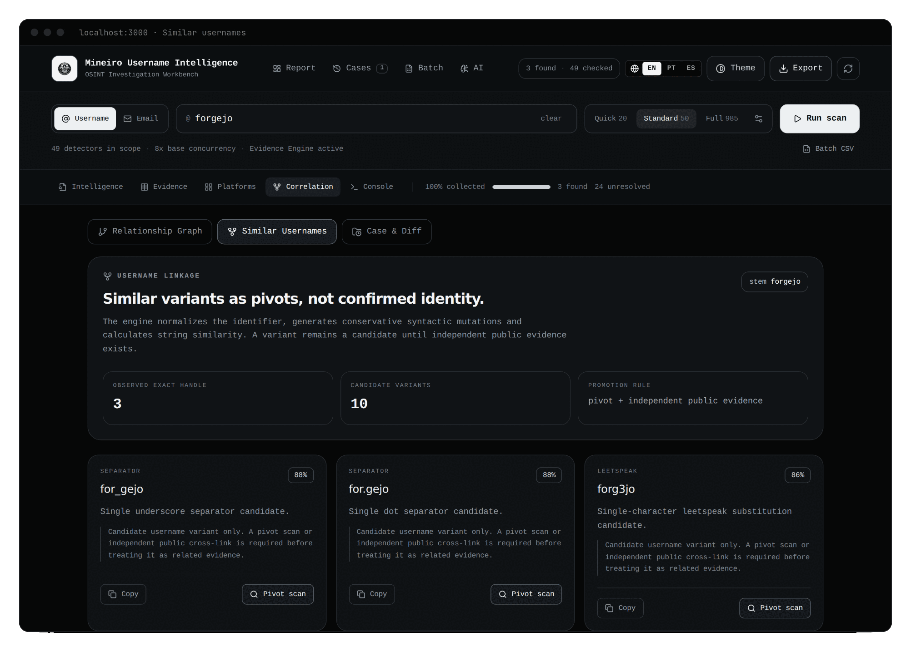

# Mineiro Username Intelligence · Graph Hunting

**OSINT Investigation Workbench**

O grafo transforma o resultado de um scan em uma superfície de investigação: dá para **ver relações**, **consultar** o grafo e **verificar candidatos**, sem tornar Neo4j obrigatório. Tudo roda no seu navegador.

> [!IMPORTANT]
> O grafo separa três coisas que nunca devem se misturar:
>
> ```text
> evidência pública observada   ≠   similaridade de username (candidato)   ≠   conclusão de identidade
> ```
>
> **Linha sólida** = observado. **Linha tracejada** = candidato. Um pivot scan confirma que o handle candidato **existe**, não que pertence ao alvo.

## Sumário

1. [Onde fica](#1-onde-fica)
2. [O que realmente aparece no grafo](#2-o-que-realmente-aparece-no-grafo)
3. [Similar Usernames: como os candidatos nascem](#3-similar-usernames-como-os-candidatos-nascem)
4. [Pivot scan](#4-pivot-scan)
5. [Mineiro Graph Query (MGQ)](#5-mineiro-graph-query-mgq)
6. [Exportar para Neo4j](#6-exportar-para-neo4j)
7. [Regras analíticas](#7-regras-analíticas)

---

## 1. Onde fica

Aba **Correlation** → sub-aba **Relationship Graph** (padrão), com o painel **Graph query** acima do mapa.

<p align="center">
  
</p>

- Clique em um nó para ver os detalhes. Em um candidato aparece o botão **Scan candidate**.
- Contadores no topo: `observed` e `candidate`.
- Legenda: **SOLID = OBSERVED**, **DASHED = CANDIDATE**.
- Limites de exibição: 24 perfis, 28 nós secundários, 16 candidatos e 90 arestas.

---

## 2. O que realmente aparece no grafo

O vocabulário do grafo é mais rico do que o que um scan real preenche hoje.

| Tipo de nó | Aparece em scans reais? |
|---|:--:|
| `TARGET`, `USERNAME` (ou `EMAIL`), `PROFILE`, `PLATFORM` | sim |
| `USERNAME_CANDIDATE` | sim (veja a seção 3) |
| `PIVOT_PROFILE` | sim, depois de um pivot scan |
| `DOMAIN`, `PUBLIC_URL`, `DISPLAY_NAME`, `ORGANIZATION`, `PUBLIC_PROJECT` | **não**: dependem de metadados que os scans atuais não capturam |

| Rótulo de aresta | Significado |
|---|---|
| `USES` | o alvo usa o handle |
| `OBSERVED_ON` | o handle foi observado em um perfil/plataforma |
| `SIMILAR_USERNAME` | candidato por similaridade (tracejada) |
| `PIVOT_CANDIDATE` | ligação de um pivô |
| `LINKS_TO`, `MENTIONS`, `HOSTED_ON`, `SAME_HANDLE`, `SAME_DOMAIN`, `REFERENCES` | existem no modelo; hoje não são geradas por scans reais |

Na prática, o grafo real é: **alvo → handle → perfis encontrados → plataformas**, mais **candidatos** e **pivôs**. As consultas por `DOMAIN` ou `SAME_DOMAIN` só retornam algo quando o grafo vem de dados que contêm esses nós (por exemplo, em testes).

---

## 3. Similar Usernames: como os candidatos nascem

<p align="center">
  
</p>

1. O handle é reduzido a um **stem**: minúsculas, sem os prefixos `real`, `the`, `iam`, `its` e sem sufixos como `.dev`, `.sec`, `.ops`, `.tech`, `.official`, `.br` (com separador `.`, `_` ou `-`), sem separadores. O stem precisa ter ≥ 3 caracteres.
2. São geradas **mutações conservadoras**:
   - **separador:** sem pontuação, `_`, `.`, `-` (e, em handles sem separador com ≥ 6 caracteres, um `_` ou `.` no meio);
   - **sufixos** `_dev`, `_sec`, `_ops`, `_tech` e **prefixos** `the_`, `real_`;
   - ***leetspeak***: troca a→4, e→3, i→1, o→0, um caractere por vez.
3. **Similaridade** = distância de Levenshtein normalizada, `round((1 − distância ÷ maior comprimento) × 100)`.
4. Ficam só os candidatos com **≥ 55**, em ordem decrescente, no máximo **24** (o grafo mostra 16).
5. Todo candidato nasce `unverified`, com a hipótese *"variante de username apenas"*.

**Nunca são gerados:** parentes, pares, e-mails prováveis, datas de nascimento, atributos privados ou sensíveis.

---

## 4. Pivot scan

**Disparo:** botão **Scan candidate** (grafo), **Pivot scan** (Similar Usernames) ou o nó no mapa D3 do Dashboard.

O que acontece:

1. roda **em segundo plano**, com o preset **Standard** (evidência e baseline ligadas, concorrência 8, modo usuário);
2. **não substitui** a investigação aberta; se já houver um scan em andamento, recusa com a mensagem *"A scan is already running…"*;
3. grava o resultado no **cache dos 5 scans** e no **mesmo caso** (como pivô e como coleta);
4. adiciona ao grafo até **8 perfis encontrados** do candidato (`PIVOT_PROFILE`, aresta `OBSERVED_ON`).

```text
forgejo (alvo)
  │  SIMILAR_USERNAME  (tracejada, candidato)
  ▼
forgejo_dev
  │  OBSERVED_ON  (sólida, observado)
  ├──► GitHub
  ├──► Codeberg
  └──► DEV
```

A primeira aresta **continua candidata** depois do pivô. As demais são observações públicas do pivô.

> [!WARNING]
> Cada pivot scan ocupa um dos 5 lugares do cache de scans e pode expulsar scans anteriores (os casos, no IndexedDB, não são afetados). Se um pivot scan falhar, a interface pode não exibir erro: veja o **Console**.

---

## 5. Mineiro Graph Query (MGQ)

Consultas **locais e somente de leitura** sobre o grafo, no painel **Graph query**. A consulta inicial vem preenchida: `MATCH candidate=true AND similarity>=70`.

- **Run** (ou `Enter`) executa · **Reset** limpa · **Export Cypher** baixa o `.cypher`.
- Seis atalhos (*chips*): *Similar usernames*, *Shared domains*, *Observed profiles*, *Strong edges*, *Same domain*, *Target → profiles*.
- Os nós que casam ficam em destaque; o resto fica esmaecido. Se a consulta casa **exatamente um** nó, ele é selecionado.

### Gramática

- Cláusulas separadas por **`AND`**. **Não existe `OR`.**
- Não diferencia maiúsculas/minúsculas; espaços repetidos são ignorados.
- Valores: letras, números, `_`, `:`, `-`. Para texto livre, `label~` aceita aspas.
- `MATCH ` é **opcional** nas cláusulas de nó.

| Cláusula | Efeito |
|---|---|
| `[MATCH] type=<TIPO>` | Nós de um tipo (`PROFILE`, `USERNAME_CANDIDATE`, `TARGET`…) |
| `[MATCH] candidate=true\|false` | Só candidatos / só observados |
| `[MATCH] label~<texto>` | Rótulo contém o texto (sem diferenciar maiúsculas) |
| `[MATCH] similarity <op> <n>` | Operadores `>=`, `<=`, `>`, `<`, `=`; só nós com pontuação de similaridade |
| `EDGE relationship=<REL>` | Arestas com aquele rótulo; os nós são as pontas dessas arestas |
| `EDGE confidence <op> <n>` | Arestas por confiança (0–100) |
| `SHARED type=<TIPO>` | Nós daquele tipo com **grau ≥ 2** e as arestas que os tocam |
| `PATH from=<TIPO> to=<TIPO>` | Caminhos entre tipos (busca em largura; até 7 nós por caminho) |

`EDGE`, `SHARED` e `PATH` **não** levam `MATCH`.

### Exemplos que funcionam

Executados sobre um grafo de exemplo (alvo `forgejo`, 3 candidatos, 2 perfis, 1 domínio):

| Consulta | Devolve |
|---|---|
| `MATCH type=PROFILE` | os 2 perfis |
| `type=profile` | o mesmo (sem `MATCH` e em minúsculas) |
| `MATCH candidate=true AND similarity>=70` | os candidatos com similaridade ≥ 70 |
| `type=USERNAME_CANDIDATE AND label~dev` | candidatos cujo rótulo contém `dev` |
| `MATCH label~"git"` | nós cujo rótulo contém `git` (casa `GitHub`) |
| `EDGE relationship=SAME_DOMAIN` | as 2 arestas e as 3 pontas (2 perfis + domínio) |
| `EDGE confidence>=90` | as arestas fortes e as suas pontas |
| `SHARED type=DOMAIN` | o domínio compartilhado e as arestas que o tocam |
| `PATH from=TARGET to=PROFILE` | o caminho alvo → handle → perfis |

### Armadilhas conhecidas

1. **Cláusula inválida não dá erro: devolve o grafo inteiro** e mostra um aviso (`Unsupported clause: …`). Se a tela de repente destaca tudo, procure o aviso. Exemplo: `MATCH candidate=true OR type=PROFILE` → aviso + grafo completo.
2. **`EDGE`, `SHARED` e `PATH` substituem o conjunto de nós** em vez de intersectar com cláusulas anteriores. `MATCH type=PROFILE AND EDGE confidence>=90` **não** devolve "perfis com arestas fortes": devolve só o resultado do `EDGE`.
3. Consultas só de nó (`MATCH …`) não retornam arestas entre nós que não estejam ligados dentro do resultado.
4. Como o grafo real não tem nós `DOMAIN` (seção 2), `SHARED type=DOMAIN` costuma voltar vazio em scans reais.

---

## 6. Exportar para Neo4j

**Export Cypher** baixa `mineiro-graph-<data-hora>.cypher` com os nós e arestas do **último resultado de consulta**:

- nós `:MineiroNode` com tipo, rótulo, flag `candidate`, pontuação de similaridade e ID de evidência;
- relações com o rótulo (em maiúsculas), a confiança e a flag `candidate`.

O Mineiro **não conecta** ao Neo4j e não envia nada para fora da máquina: ele só gera texto. Para usar, execute o arquivo no Neo4j Browser ou com `cypher-shell`.

Modelo recomendado:

```text
(:MineiroNode {type:"USERNAME"})
  -[:SIMILAR_USERNAME {candidate:true}]->
(:MineiroNode {type:"USERNAME_CANDIDATE"})

(:MineiroNode {type:"USERNAME_CANDIDATE"})
  -[:OBSERVED_ON {candidate:false}]->
(:MineiroNode {type:"PIVOT_PROFILE"})
```

---

## 7. Regras analíticas

1. Similaridade de string **não** é identidade.
2. Um pivô encontrado **não** confirma vínculo com o alvo original.
3. Arestas observadas e candidatas nunca compartilham a mesma semântica visual (sólida × tracejada).
4. As consultas são somente leitura.
5. O Cypher exportado preserva `candidate=true/false`.
6. Para elevar uma hipótese de correlação é preciso **evidência pública independente**: veja a [receita 5](RECEITAS.md#5-validar-um-username-candidato-pivô).
