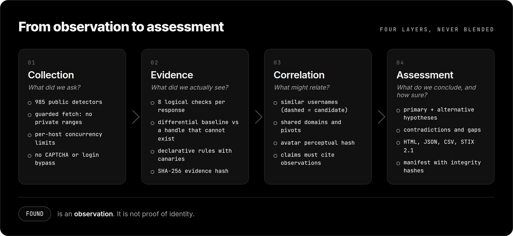
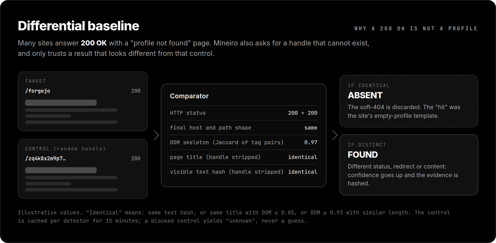

# Mineiro Username Intelligence · Metodologia analítica

**OSINT Investigation Workbench** · válida para a versão 1.7.0

O Mineiro não deve responder apenas "onde apareceu". Ele ajuda o analista a separar:

- o que foi **observado**;
- o que é **provável**;
- o que **contradiz** a hipótese;
- o que **ainda falta**;
- qual **próximo passo** tem maior valor.

Este documento explica o método e, na seção [Como os números são calculados](#como-os-números-são-calculados), **as fórmulas reais** do código, para que ninguém precise tratar um número como caixa-preta.

## Sumário

1. [Pipeline](#pipeline)
2. [Evidence Engine: 8 checks e uma baseline](#evidence-engine-8-checks-e-uma-baseline)
3. [Como os números são calculados](#como-os-números-são-calculados)
4. [Julgamentos, hipóteses, contradições e lacunas](#julgamentos-hipóteses-contradições-e-lacunas)
5. [Requisitos de inteligência](#requisitos-de-inteligência)
6. [Proveniência](#proveniência)
7. [O papel da IA](#o-papel-da-ia)
8. [Integridade e manifest](#integridade-e-manifest)
9. [Limites do método](#limites-do-método)

---

## Pipeline

```text
Collection → Evidence → Correlation → Hypotheses → Contradictions → Assessment → Pivots → Collection plan
```

<p align="center">
  
</p>

Cada camada tem uma pergunta: *o que perguntamos? o que vimos? o que pode se relacionar? o que concluímos e com que certeza?* Elas nunca são fundidas num só score.

---

## Evidence Engine: 8 checks e uma baseline

### Os 8 checks

Para **cada** resposta HTTP o motor extrai 8 verificações lógicas. Elas **não** são 8 requisições: saem do mesmo corpo (lido até 192 KiB).

| # | Check | Pergunta |
|---|---|---|
| 1 | `status_expected` | O código HTTP é o esperado para presença? |
| 2 | `absence_status` | É o código de ausência (404)? |
| 3 | `redirect_consistency` | O host final é compatível com o pedido? |
| 4 | `username_final_url` | O handle continua na URL final? |
| 5 | `username_body` | O handle aparece no corpo? |
| 6 | `canonical_match` | O `canonical` é do mesmo host e contém o handle? |
| 7 | `soft_404` | Há dicas de "não encontrado" no corpo? |
| 8 | `edge_protection` | Há sinais de WAF/Cloudflare? |

Com 985 detectores, são **7.880** checks *lógicos* possíveis (985 × 8), não 7.880 requisições. Um perfil `found` sempre falha o check 2, então o máximo prático é **7/8**.

### A baseline diferencial

O problema central de detectar presença por HTTP é o **soft-404**: o site responde `200 OK` com uma página "perfil não encontrado". A baseline ataca isso diretamente:

<p align="center">
  
</p>

1. Para cada detector, o servidor também consulta um **handle de controle** que não pode existir (`zq` + 18 caracteres aleatórios) e guarda a "impressão digital" dessa página por 15 minutos.
2. Compara a página do alvo com a do controle: **status**, **forma do redirecionamento** (host e caminho com o handle trocado por `:u`), **esqueleto do DOM** (similaridade de Jaccard entre pares de tags consecutivas), **título** e **hash do texto visível** (ambos com o handle removido).
3. Considera as páginas **idênticas** se: o hash do texto é igual, **ou** o título é igual e o DOM tem Jaccard ≥ 0,85, **ou** o DOM tem Jaccard ≥ 0,93 e os tamanhos diferem pouco (razão ≥ 0,9).
4. Veredito: **idêntica** → o resultado vira *absent*; **diferente** → ganha +8 de confiança (teto 97) e pode subir para `confirmed`; **controle inutilizável** (status 0, 401, 403, 407, 408, 429, 500, 502, 503, 504) → sem conclusão (`baseline_unavailable`).

Ela só roda em **Standard** e **Full** (e nas chamadas de API com `baseline: true`).

### Regras declarativas

Alguns detectores têm regras em JSON (`registry/detectors/*.json`): condições de **presença** (todas devem casar) e de **ausência** (qualquer uma; **tem precedência**), fonte, data de verificação, *User-Agent* e **canários**. Hoje: Codeberg, DEV e Keybase. Veja [REGISTRY.md](../REGISTRY.md).

---

## Como os números são calculados

Todos os valores são inteiros de 0 a 100. `rel` é a **Detector Reliability** do catálogo.

### Observation Confidence (confiança desta consulta)

| Situação | Fórmula |
|---|---|
| Ausência (404/código de ausência) | `clamp(80..98, rel×0,45 + 55)` |
| Presença (código esperado) | `clamp(35..97, rel×0,6 + (checks_ok ÷ 8)×100×0,4)`; sem Evidence Engine, usa 0,65 no lugar da razão |
| Presença com *soft-404* | limitada a 45 |
| Outro código | `clamp(30..85, rel×0,55 + razão×100×0,45)` |
| Bloqueio sem nova tentativa | 429 → 35 · outros → 42 |
| *Timeout* → 40 · erro → 10 | |
| Baseline **idêntica** | `clamp(80..95, rel×0,3 + 62)` (e o resultado vira *absent*) |
| Baseline **diferente** | `+8` (teto 97) |
| Regra declarativa de ausência / presença | mínimo 90 / mínimo 85 (teto 97) |

### Nível de evidência

| `evidenceLevel` | Quando |
|---|---|
| `confirmed` | ≥ 6 de 8 checks; **ou** baseline "diferente" com ≥ 5 checks; **ou** regra declarativa de presença |
| `probable` | Código esperado (sem Evidence Engine, todo `found` fica aqui) |
| `absent` | 404, baseline idêntica ou regra de ausência |
| `uncertain` | Bloqueios e respostas inesperadas |

### Correlation Confidence

```text
correlação = 24% × detector + 34% × observação + 24% × (checks_ok ÷ checks_total) + 18% × corroboração
```

A **corroboração** é `min(1, achados `found` da mesma categoria ÷ 4)`: quatro ou mais achados na mesma categoria saturam o termo.

### Intelligence Priority Score (IPS)

```text
IPS = 28% × qualidade da evidência + 30% × correlação + 14% × novidade + 28% × relevância ao requisito
```

- *qualidade da evidência* = razão de checks × 100;
- *novidade* = 85 se for o único achado da categoria, senão 60;
- *relevância* depende do **requisito** e da categoria:

| Requisito | Relevância |
|---|---|
| Username presence | 75 (todas) |
| Public account correlation | 85 (todas) |
| Digital footprint mapping | 82 (todas) |
| Developer footprint | 98 (developer, security) · 60 (community) · 35 (demais) |
| Threat research alias mapping | 92 (security, developer, community) · 45 (demais) |
| Brand impersonation monitoring | 95 (social, community, media) · 45 (demais) |

Bandas: **HIGH ≥ 78**, **MEDIUM ≥ 50**, **LOW** abaixo disso. O *valor analítico* combina `26% detector + 27% observação + 24% correlação + 23% IPS`.

> [!WARNING]
> **O IPS prioriza achados, não pessoas.** Ele não mede risco, culpa ou intenção de ninguém.

### Source Quality (A–E)

| Nota | Regra |
|---|---|
| **A** | metadados autodeclarados **e** detector ≥ 90, observação ≥ 85, ≥ 3 sinais |
| **B** | detector ≥ 80 e observação ≥ 75 |
| **C** | detector ≥ 65 e observação ≥ 55 |
| **D** | resultado `uncertain` ou `rate_limited` |
| **E** | o restante |

Source Quality **não** é Detector Reliability. Hoje os scans não capturam metadados autodeclarados, então a nota **A não ocorre** em coletas reais.

### Cobertura da coleta

```text
conclusivos = found + absent
cobertura efetiva = conclusivos ÷ solicitados
bloqueados/inconclusivos = uncertain + rate_limited + error
```

*Três contas em 984 pedidos não é o mesmo que três contas em 92 consultas concluídas.*

### Clusters

Agrupam os `found` por categoria. `weightedScore` = média de `(rel ÷ 100) × (confiança ÷ 100)` dos achados da categoria. Um achado é "forte" se `rel ≥ 80` e `confiança ≥ 75`. Sobreposições entre clusters só aparecem quando há **domínios compartilhados** (hoje raro, pois os links extraídos não são capturados).

---

## Julgamentos, hipóteses, contradições e lacunas

### Key Intelligence Judgments

Cada julgamento tem **texto**, **banda de confiança** e **base**. Bandas: **HIGH ≥ 80**, **MODERATE ≥ 55**, **LOW** abaixo.

| ID | Quando existe | Banda calculada por |
|---|---|---|
| KJ-01 | sempre | `40% × cobertura efetiva + 60% × min(100, nº de achados de valor alto × 12)` |
| KJ-02 | se houver cluster líder | `weightedScore` do cluster |
| KJ-03 | se houver bloqueios/inconclusivos | sempre `HIGH`: é a confiança de que *as lacunas limitam conclusões negativas* |

KJ-03 pode parecer contraditório ("confiança alta" num scan cheio de `UNCERTAIN`), mas é exatamente o ponto: a ferramenta tem alta confiança de que **não pode concluir ausência** onde foi bloqueada.

### Disciplina de hipóteses

Toda hipótese precisa aceitar: evidência de apoio, evidência contrária, ressalva e uma **alternativa**. A alternativa padrão inclui homonímia e coincidência de username.

### Contradições

Sinalizadas quando, entre os achados `found`, há mais de um valor distinto de nome de exibição, localização, organização ou hash de avatar, e quando há achados **fracos** (`rel < 60` ou confiança `< 55`). Como os scans atuais não capturam metadados de perfil, **na prática só a contradição por "achado fraco" aparece**.

### Lacunas

Perguntas não respondidas que **mudariam** a avaliação: o que mudaria se os serviços inconclusivos respondessem? Há link cruzado público independente? Algum achado pode ser promovido por uma fonte mais forte? Cada lacuna tem importância (HIGH/MEDIUM/LOW) e motivo.

### Priorização de pivôs

1. corroboração **independente**;
2. evidência de **alta qualidade**;
3. resolução de **contradições**;
4. fechamento de **lacunas**;
5. só depois, **expansão** de coleta.

### Condição de parada

A coleta deve parar quando novos achados não alteram materialmente julgamentos, hipóteses, lacunas ou confiança.

---

## Requisitos de inteligência

A pergunta escolhida muda **relevância e prioridade**, nunca o fato observado. Veja a tabela de relevâncias acima e o [guia de uso](USER-GUIDE.md#12-pergunta-de-inteligência).

---

## Proveniência

| Tipo | Significado |
|---|---|
| `PRIMARY` | observado diretamente pelo Mineiro |
| `DERIVED` | calculado de forma determinística a partir de evidência |
| `EXTERNAL` | importado de outra fonte, com atribuição |
| `AI_SYNTHESIZED` | produzido pelo copiloto |

Toda saída de IA continua distinguível das camadas observadas e derivadas.

### Analytic ledger

Cada julgamento recebe uma entrada `A-xxx` com a afirmação, a confiança, os IDs das evidências de apoio e contrárias, a data de geração e proveniência `DERIVED`.

### Linha do tempo

O sistema distingue, **quando a fonte realmente fornece o dado**, `SCAN_TIMESTAMP`, `ACCOUNT_CREATED`, `FIRST_PUBLIC_EVIDENCE` e `SOURCE_OBSERVED`. A ausência de um timestamp **não** é preenchida por inferência.

---

## O papel da IA

A IA **pode**: resumir, ordenar evidências, propor hipóteses alternativas, destacar contradições, sugerir pivôs e reformular perguntas.

A IA **não pode**: transformar inferência em fato, elevar confiança automaticamente, concluir identidade por username, inferir atributos sensíveis ou classificar criminalidade sem evidência explícita.

Garantias técnicas: o modelo recebe só o *assessment* (não a internet), a saída tem esquema obrigatório, **IDs de evidência inventados são descartados** e toda resposta traz `factualConfidenceRaised: false`. O que é enviado ao provedor está em [PRIVACIDADE-E-DADOS.md](PRIVACIDADE-E-DADOS.md#o-que-o-gemini-recebe-copiloto).

---

## Integridade e manifest

Cada exportação gera um `.manifest.json` com formato, alvo, requisito, seções incluídas e excluídas, **SHA-256 do conteúdo** (`payloadSha256`) e o escopo do hash (`payload-before-manifest`). Conferimos nos quatro formatos que `sha256sum` do arquivo coincide com o manifest.

O hash comprova **integridade** do arquivo exportado. **Não** comprova autoria nem identidade, e não é assinatura.

Além disso, as respostas da API trazem `evidenceHash` (SHA-256 de `status + URL final + corpo lido`), `collectedAt` e `detectorVersion`, base para uma cadeia de custódia ([receita 9](RECEITAS.md#9-cadeia-de-custódia-e-integridade)).

---

## Limites do método

Para que ninguém superestime o que vê:

1. **Presença ≠ identidade.** E ausência ≠ inexistência.
2. **Catálogo não auditado:** 0 dos 985 detectores têm proveniência verificada; só 3 têm regra declarativa confirmada ao vivo. `Detector Reliability` é uma estimativa.
3. **Bloqueios são comuns** e não são contornados. A cobertura efetiva costuma ser menor que 60% em scans Standard.
4. **Metadados de perfil não são capturados** hoje; por isso clusters cruzados, contradições de perfil e a nota A de fonte praticamente não ocorrem.
5. **Modo e-mail:** usa o endereço inteiro como handle em plataformas `both`; os `HIT` ali são fracos.
6. **O mesmo username é uma pista, não uma prova.** Corroboração independente é obrigatória para elevar uma hipótese de correlação.
