# Mineiro Username Intelligence · Guia de uso

**OSINT Investigation Workbench**

Este é o manual de referência da interface: cada tela, cada controle, o que ele faz de verdade e onde estão as armadilhas. Para a primeira vez, comece por [GETTING-STARTED.md](GETTING-STARTED.md). Para consulta rápida, use a [CHEATSHEET.md](CHEATSHEET.md).

> [!IMPORTANT]
> **Princípios que valem em todas as telas**
> 1. `FOUND`/`HIT` é uma **observação** pública. **Não** é prova de identidade.
> 2. `UNCERTAIN` (bloqueado, limitado, inconclusivo) **nunca** significa "não existe".
> 3. IA **resume e prioriza**; não cria confiança factual.
> 4. Use apenas informação pública, com finalidade **legítima e autorizada**.

## Sumário

1. [Mapa da interface](#1-mapa-da-interface)
2. [Definir o alvo](#2-definir-o-alvo)
3. [Escolher a profundidade (presets e configuração avançada)](#3-escolher-a-profundidade)
4. [Executar e acompanhar](#4-executar-e-acompanhar)
5. [Ler o resultado: as visões](#5-ler-o-resultado-as-visões)
6. [Selos de status e pontuações](#6-selos-de-status-e-pontuações)
7. [Abrir um finding](#7-abrir-um-finding)
8. [Candidatos de username e pivôs](#8-candidatos-de-username-e-pivôs)
9. [Modo e-mail](#9-modo-e-mail)
10. [Lote (CSV)](#10-lote-csv)
11. [Casos e Diff Intelligence](#11-casos-e-diff-intelligence)
12. [Pergunta de inteligência (requirement)](#12-pergunta-de-inteligência)
13. [Exportar o relatório](#13-exportar-o-relatório)
14. [Copiloto de IA](#14-copiloto-de-ia)
15. [Idioma, tema e atalhos](#15-idioma-tema-e-atalhos)
16. [Quando parar](#16-quando-parar)
17. [Comportamentos e limites conhecidos da interface](#17-comportamentos-e-limites-conhecidos-da-interface)

---

## 1. Mapa da interface

```text
┌──────────────────────────────────────────────────────────────────────────────┐
│ CABEÇALHO   logo · Report · Cases · Batch · AI      EN PT ES · Theme · Export · ⟲│
├──────────────────────────────────────────────────────────────────────────────┤
│ BARRA DE ALVO   [Username|Email]  [ campo do alvo ]  [Quick|Standard|Full] ⚙ ▶ │
├──────────────────────────────────────────────────────────────────────────────┤
│ ABAS   Intelligence · Evidence · Platforms · Correlation · Console │ progresso │
├──────────────────────────────────────────────────────────────────────────────┤
│                       ÁREA PRINCIPAL (muda com a aba)                          │
└──────────────────────────────────────────────────────────────────────────────┘
```

| Elemento | O que faz |
|---|---|
| **Report** | Leva à aba Intelligence. |
| **Cases** | Abre o histórico: casos persistentes e o cache dos 5 últimos scans. |
| **Batch** | Abre a importação em lote (CSV/TXT). |
| **AI** | Abre a área do copiloto de IA (e a configuração do Gemini). Aparece só em telas largas (≥ `lg`). |
| **EN · PT · ES** | Idioma. Padrão: português. |
| **Theme** | Alterna `dark → bone → high-contrast`. Veja [§15](#15-idioma-tema-e-atalhos). |
| **Export** | Constrói e baixa o relatório. Desabilitado até existir resultado. |
| **⟲ (Clear workspace)** | Limpa a sessão **em memória** e volta à tela inicial. Não apaga casos nem cache. |
| **Barra de alvo** | Alvo, modo (usuário/e-mail), preset, configuração avançada (⚙) e Run/Stop. |
| **Abas** | Seis visões do mesmo resultado; **Batch** só aparece quando há lote. |

Duas visões não têm aba: o **Dashboard** (tecla `1`) e a área **AI** (botão no cabeçalho ou tecla `4`).

A **tela inicial** aparece enquanto não há resultados nem scan em andamento:

<p align="center">
  
</p>

---

## 2. Definir o alvo

### Usuário (username)

Digite o *handle* sem espaços. O `@` inicial é removido ao digitar no campo da **tela inicial**; na **barra de alvo** ele também é removido ao executar. O Mineiro substitui `{username}` no padrão de URL de cada detector, com *URL-encoding*.

### Entrada tolerante (tela inicial)

| Você digita/cola | O Mineiro faz |
|---|---|
| `https://github.com/forgejo` | Reconhece o padrão de URL de um dos detectores e sugere `@forgejo` (botão **Use @forgejo**). |
| `ana@example.org` no modo usuário | Avisa que parece e-mail e oferece **Switch to e-mail mode**. |
| `john smith` | Avisa que usernames raramente têm espaços e sugere `johnsmith`. |
| `@@alice` | Remove os `@` iniciais enquanto você digita. |
| e-mail inválido no modo e-mail | Avisa; você ainda pode executar. |

Com uma sugestão disponível, o **Enter aplica a correção** em vez de executar; um segundo **Enter** executa. Isso evita varrer 49 sites com um valor que sabemos estar errado.

### Exemplos

Os chips `@forgejo`, `@nodejs` e `@rust-lang` são **organizações públicas de código aberto**, boas para testar. Em testes, tutoriais e relatórios de bug use sempre handles assim, **nunca** o de uma pessoa privada.

---

## 3. Escolher a profundidade

### Presets

| Preset | Escopo | Detectores (usuário · e-mail) | Concorrência | Timeout | Evidence Engine + baseline | Progressivo |
|---|---|---:|---:|---:|:--:|:--:|
| **Quick** (padrão) | Top 20 | 19 · 13 | 10 | 2,5 s | não | não |
| **Standard** | Top 50 | 49 · 31 | 8 | 4,5 s | **sim** | não |
| **Full** (`deep`) | todos | 984 · 59 | 6 | 6,5 s | **sim** | **sim** |
| **Email-only** | nenhum | 0 | 8 | 2,5 s | não | não |
| **Custom** | o que você montar | | | | | |

- Use **Quick** para confirmar que o ambiente funciona. Ele **não** liga o Evidence Engine nem a baseline: espere falsos positivos (`HIT` em sites que respondem 200 a qualquer caminho).
- Use **Standard** para investigações normais.
- Use **Full** só quando a cobertura ampla realmente importa. Ele roda em **duas fases**: (1) descoberta rápida dos 984 detectores (modo rápido, sem evidência, concorrência de até 20); (2) validação aprofundada apenas dos candidatos `found`, `uncertain` ou `rate_limited` (evidência e baseline ligadas, concorrência até 8).
- A interface mostra "20/50/985" como números redondos. Os valores acima são os **reais**.

> [!TIP]
> Mais tráfego não é mais inteligência. Repetir um Full sem motivo só aumenta bloqueios.

### Configuração avançada (⚙)

<p align="center">
  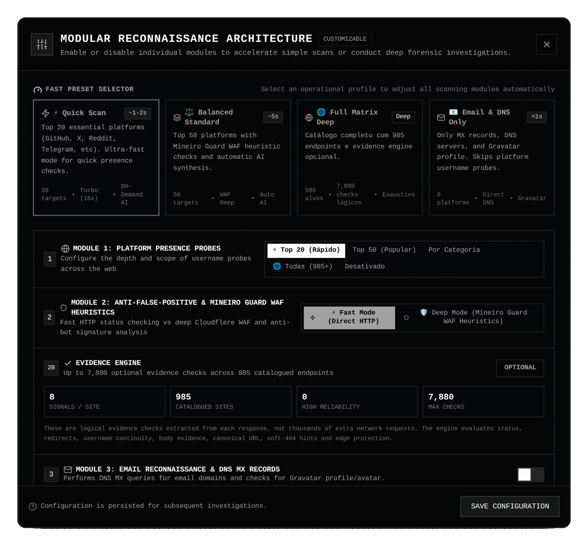
</p>

| Módulo | Opções | Observação |
|---|---|---|
| **Seletor de preset** | 4 cartões: Quick, Standard, Full, Email & DNS Only | Aplica os valores da tabela acima. |
| **1 · Sondas de presença** | Top 20 · Top 50 · Por categoria · Todas · Desativado | "Por categoria" mostra chips de categoria. Qualquer mudança vira `custom`. |
| **2 · Anti-falso-positivo e proteção** | **Fast** (2,5 s) ou **Deep** | No modal, Deep define **5 s**; os presets Standard/Full usam 4,5 s/6,5 s. |
| **2B · Evidence Engine** | Liga/desliga os 8 checks (e a baseline) | São checks **lógicos** extraídos da mesma resposta, não 7.880 requisições. |
| **3 · Reconhecimento de e-mail** | Liga MX, Gravatar e heurísticas | Desligado no Quick. |
| **4 · IA** | Rótulo "AI Copilot · On demand" | **Sem efeito**: o copiloto é sempre sob demanda. |
| **5 · Concorrência** | 4 · 8 · 16 · 24 | Simulações por onda. |
| **Resumo** | nº de plataformas e estimativa de tempo | Estimativa = `⌈plataformas ÷ concorrência⌉ × 0,35 s (fast) ou 0,65 s (deep)`. |

Ações: **Save Configuration** guarda; **Start Scan Now** (só com alvo) guarda e inicia.

> [!WARNING]
> **Armadilha conhecida:** o modal guarda o estado de quando a página foi carregada. Se você mudar de preset *fora* dele (botões da barra ou tecla `D`), ele não reflete a mudança ao reabrir, e **Save** pode regravar os valores antigos. Para editar a partir do preset atual, recarregue a página antes de abrir o modal, ou escolha o cartão de preset **dentro** dele.

### Tecla `D`: Fast ↔ Deep

Alterna só o *timeout* de sondagem (2,5 s ↔ 6,5 s) e marca o preset como `custom`. **Não** liga o Evidence Engine.

### O que a configuração **não** faz

O Mineiro **nunca** tenta contornar bloqueios na interface: a estratégia de nova tentativa enviada ao servidor é sempre `none`, qualquer que seja o preset ou a tecla `D`. Um `403`/`429`/desafio de borda vira `UNCERTAIN`/`RATE_LMT`, e fim.

---

## 4. Executar e acompanhar

1. **Run scan** (ou `Enter`, ou `Ctrl+Enter` de qualquer lugar).
2. As consultas saem em **ondas**: o tamanho da onda é a concorrência (entre 2 e 24); cada onda espera a anterior terminar. No servidor, no máximo **4 conexões simultâneas por site**.
3. A barra mostra `% collected`, `found` e `unresolved`.
4. **Stop** interrompe; os resultados parciais permanecem na tela, mas um scan interrompido **não** gera caso.
5. Ao terminar, o app mostra a aba Intelligence e grava o scan no cache e em um **caso** (veja [§11](#11-casos-e-diff-intelligence)).

### Console

<p align="center">
  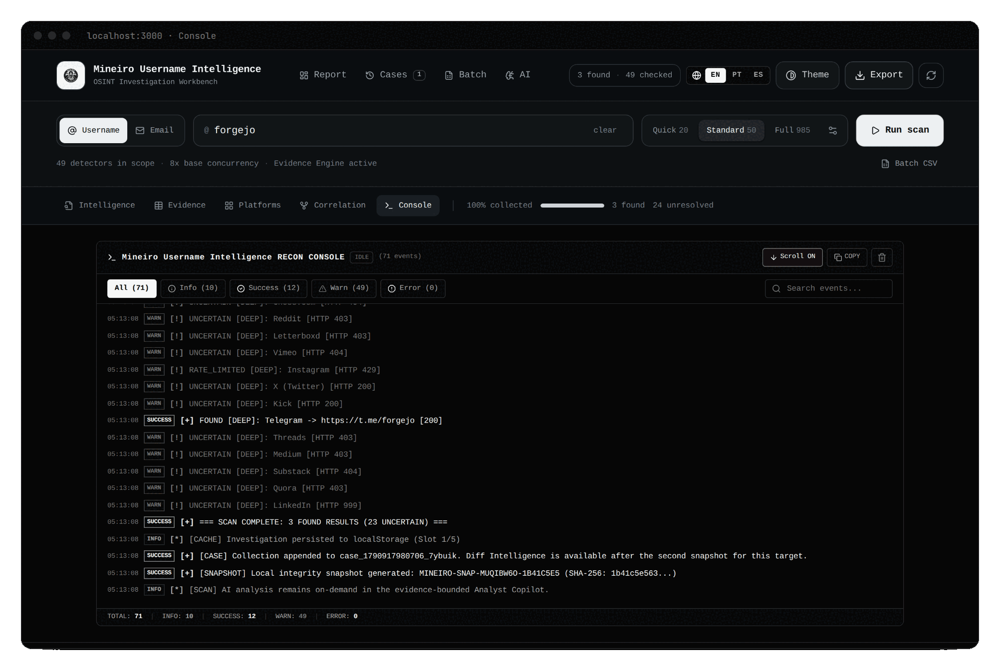
</p>

Mostra cada evento em tempo real: `FOUND`, `UNCERTAIN [DEEP]: Reddit [HTTP 403]`, `RATE_LIMITED`, o resumo `SCAN COMPLETE`, e as linhas `[CACHE]`, `[CASE]` e `[SNAPSHOT]` (com o SHA-256 do estado). Filtros por nível (All, Info, Success, Warn, Error), busca, rolagem automática, copiar e limpar. O log vive só na memória da aba.

---

## 5. Ler o resultado: as visões

### Intelligence (relatório de 22 seções)

É a visão padrão. Leia **de cima para baixo**:

| # | Seção | Para quê |
|---|---|---|
| 01 | Intelligence Requirement | Escolha a pergunta ([§12](#12-pergunta-de-inteligência)). |
| 02 | **Executive view** | Known · Assessed · Unknown e a saúde da coleta. |
| 03 | **Key judgments** | Cada julgamento com nível de confiança e base. |
| 04 | Collection coverage | O que foi realmente consultado e o que foi conclusivo. |
| 05 | High-confidence findings | Os achados mais fortes (até 10). |
| 06 | Evidence matrix | Detector, observação, correlação, fonte e IPS lado a lado (até 30). |
| 07–08 | Clusters e Correlation graph | Pegada por tipo de serviço e relações. |
| 09–11 | Hypotheses · Supporting · **Contradictory evidence** | Hipótese principal e alternativa; leia as contradições **antes** de elevar qualquer hipótese. |
| 12–13 | Unresolved · **Intelligence gaps** | O que não dá para concluir e qual lacuna mudaria a avaliação. |
| 14–16 | Timeline · Pivots · Collection plan | Próximos passos com valor esperado. |
| 17–19 | Reliability · Methodology · Provenance | Como os números foram produzidos. |
| 20–22 | Technical appendix · Integrity snapshot · Export manifest | Contagens, hash do estado e o que será exportado. |

<p align="center">
  
</p>

Âncoras de navegação no topo: Requirement, Assessment, Evidence, Correlation, Gaps, Integrity. Botões **Audit table** (vai para Evidence) e **Export**.

**Seção 04 · Collection coverage** merece atenção, porque corrige um erro comum:

<p align="center">
  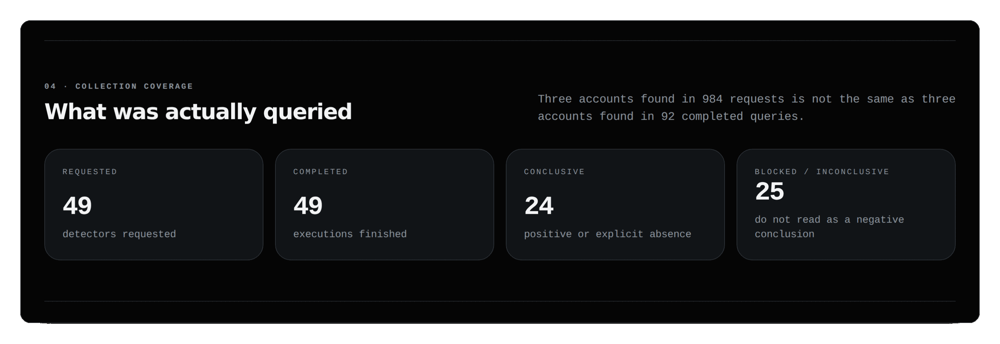
</p>

> "Três contas encontradas em 984 pedidos não é o mesmo que três contas encontradas em 92 consultas concluídas."

**Conclusivo** = `found` + `absent`. **Bloqueado/inconclusivo** = não use como conclusão negativa.

### Evidence (tabela de auditoria)

<p align="center">
  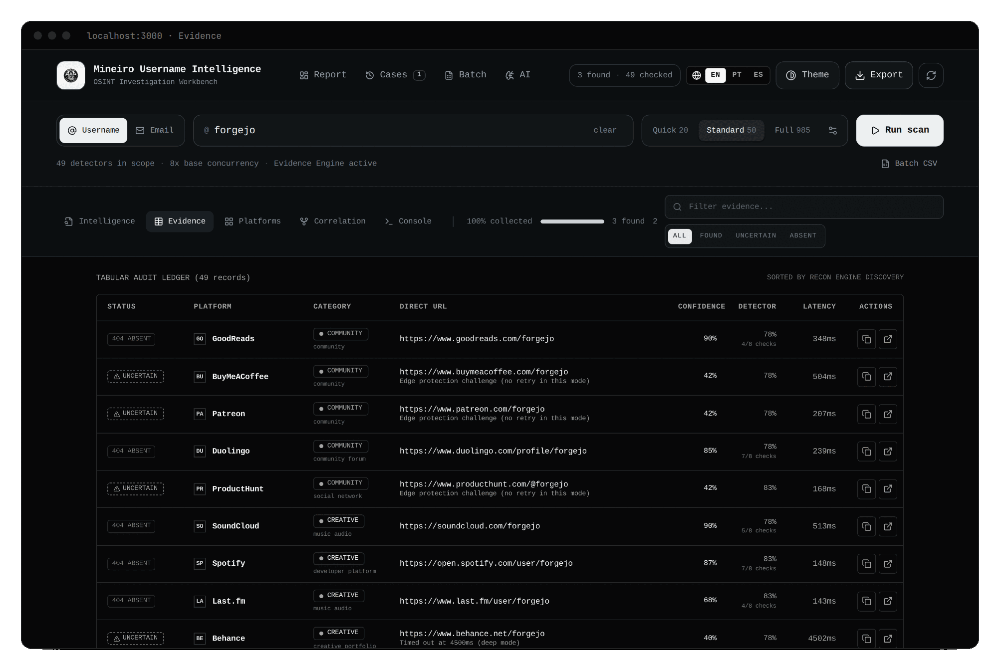
</p>

Uma linha por detector: **Status**, **Platform**, **Category**, **Direct URL**, **Confidence**, **Detector** (confiabilidade e `x/y checks`), **Latency** e ações (copiar a URL, abrir em nova aba). Filtros: caixa de busca (nome ou URL) e botões **All · Found · Uncertain · Absent**. O filtro *Uncertain* inclui `RATE_LMT`. A ordem é a de descoberta (não há ordenação por coluna).

> [!NOTE]
> Para auditar *por que* um item foi classificado assim, abra-o no relatório ([§7](#7-abrir-um-finding)): os **sinais de evidência** estão lá.

### Platforms (cartões)

Os mesmos dados em cartões, com os mesmos filtros e botões de copiar/abrir. Útil para varrer visualmente muitas plataformas.

### Correlation (três sub-abas)

| Sub-aba | O que mostra |
|---|---|
| **Relationship Graph** | Grafo de relações (nós sólidos = observados; tracejados = candidatos) e o painel de consulta ([§8](#8-candidatos-de-username-e-pivôs) e [GRAPH-HUNTING.md](GRAPH-HUNTING.md)). |
| **Similar Usernames** | Variantes do handle como candidatos a pivô. |
| **Case & Diff** | Comparação entre dois snapshots do mesmo alvo ([§11](#11-casos-e-diff-intelligence)). |

<p align="center">
  
</p>

### Console

Veja [§4](#4-executar-e-acompanhar).

### Dashboard (tecla `1`)

Uma visão agregada ("OSINT investigation ledger") com o estado do registry, distribuição por categoria, confiabilidade dos detectores, mapas e matrizes de risco. **Não tem aba**: abre com a tecla `1` (fora de campos de texto).

<p align="center">
  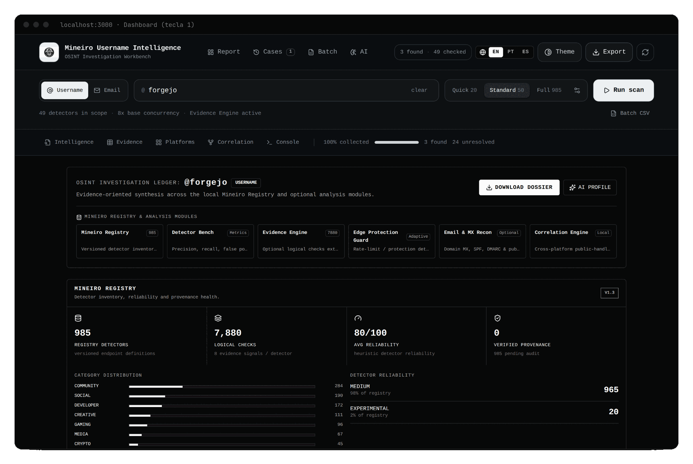
</p>

> [!NOTE]
> Alguns números do Dashboard são **ilustrativos**, por exemplo o "Confidence index". Para decisões, use a aba Intelligence e a Evidence.

### AI

Veja [§14](#14-copiloto-de-ia).

---

## 6. Selos de status e pontuações

### Selos

| Selo | `status` | Quando aparece |
|---|---|---|
| `HIT // 200` | `found` | O site respondeu como se o perfil existisse. O texto do selo é fixo, mesmo que o código HTTP seja outro 2xx. |
| `404 ABSENT` | `not_found` | Código de ausência (404), *soft-404* detectado, baseline idêntica à página de ausência, ou regra declarativa de ausência. **Atenção:** qualquer resposta **não-2xx** que não seja bloqueio (por exemplo 401, 410, 5xx) também vira `not_found`. |
| `UNCERTAIN` | `uncertain` | Bloqueio (403/503, desafio de borda, WAF), resposta 2xx diferente da esperada, ou *timeout*. A razão aparece abaixo da URL (`uncertainReason`). |
| `RATE_LMT` | `rate_limited` | HTTP 429 do site. |
| `ERROR` | `error` | Falha antes de haver veredito: rede, ou recusa do **servidor local** (URL fora do padrão, limite de taxa local). O motivo está no *tooltip*. |
| `SCANNING` · `QUEUED` | | Em andamento / na fila. |

### As cinco pontuações (não as misture)

| Pontuação | Responde | Onde vê |
|---|---|---|
| **Detector Reliability** | A regra deste site costuma ser confiável? | Tabela (coluna Detector) e Evidence matrix |
| **Observation Confidence** | Esta consulta específica foi conclusiva? | Coluna *Confidence* e Evidence matrix |
| **Correlation Confidence** | Este achado ajuda a sustentar relação com outros? | Evidence matrix e detalhe |
| **Source Quality** | Quão forte é a fonte pública observada? (letras `A`–`E`) | Evidence matrix |
| **IPS** (Intelligence Priority Score) | Vale revisar este achado antes dos demais? | Evidence matrix |

> [!WARNING]
> **IPS não mede risco de pessoa nenhuma.** Ele só ordena a revisão de achados. O Mineiro não pontua pessoas.

Fórmulas e interpretação: [INTELLIGENCE-METHODOLOGY.md](INTELLIGENCE-METHODOLOGY.md) e [GLOSSARIO.md](GLOSSARIO.md).

---

## 7. Abrir um finding

Na aba **Intelligence**, clique no **cartão** de um achado de alta confiança ou na **linha** da Evidence matrix. O detalhe traz:

- URL e *timestamp* de captura;
- código HTTP e latência;
- as três confianças, qualidade da fonte e IPS;
- **Evidence signals** (os sinais emitidos pelo motor; veja o [glossário de sinais](GLOSSARIO.md#sinais-de-evidência));
- metadados públicos capturados (quando houver);
- *why it matters* e o *pivot* recomendado.

Exemplo de sinais de um `found` confirmado pela baseline: `http_status:200`, `username_in_final_url`, `baseline_status_differs:200_vs_404`, `rule_present:status`.

---

## 8. Candidatos de username e pivôs

**Similar Usernames** gera variantes do handle e as trata como **candidatas**, nunca como identidade.

- **Como são geradas:** normaliza o handle ("stem": sem prefixos `real`/`the`/`iam`/`its` e sufixos como `.dev`, `.sec`, `.ops`, `.tech`, `.official`, `.br`) e aplica: separadores (`_`, `.`, `-`, sem pontuação), sufixos `_dev/_sec/_ops/_tech`, prefixos `the_/real_` e *leetspeak* (a→4, e→3, i→1, o→0).
- **Similaridade:** distância de Levenshtein normalizada, de 0 a 100. Só ficam candidatos com **≥ 55**, até **24**; o grafo exibe 16.
- Cada candidato nasce como `unverified`, com a hipótese "variante de username apenas".

<p align="center">
  
</p>

### Pivot scan

Botões **Pivot scan** (aba Similar Usernames), **Scan candidate** (grafo) ou o nó no D3. Roda um scan **Standard** (com evidência e baseline) do username candidato **em segundo plano**, sem substituir a investigação atual. Se já houver um scan em andamento, ele recusa.

O resultado entra no cache, no **mesmo caso** como pivô, e no grafo (até 8 perfis encontrados do candidato). Um pivô bem-sucedido confirma que **o handle candidato existe**, não que pertence à mesma pessoa.

> [!CAUTION]
> O mesmo username em dois serviços **não prova** que é a mesma pessoa: pode ser homonímia, coincidência, ou alguém se passando por outro. Valide com uma **fonte independente** antes de elevar qualquer hipótese.

### Consultas no grafo

O painel **Graph query** permite perguntas como `MATCH candidate=true AND similarity>=70` ou `PATH from=TARGET to=PROFILE`, e exportar para Neo4j (arquivo `.cypher`; **não** conecta a nenhum banco). Sintaxe completa e exemplos: [GRAPH-HUNTING.md](GRAPH-HUNTING.md).

---

## 9. Modo e-mail

Use o seletor **Email** ao lado do campo. O que ele faz depende do preset:

| Etapa | Quick | Standard / Full / Email-only |
|---|:--:|:--:|
| Reconhecimento do **endereço** (sintaxe, descartável, provedor comum, MX, Gravatar) | **não** | sim |
| Sondas em plataformas `both` (13 / 31 / 59 detectores) | sim | sim (Email-only: nenhuma) |

<p align="center">
  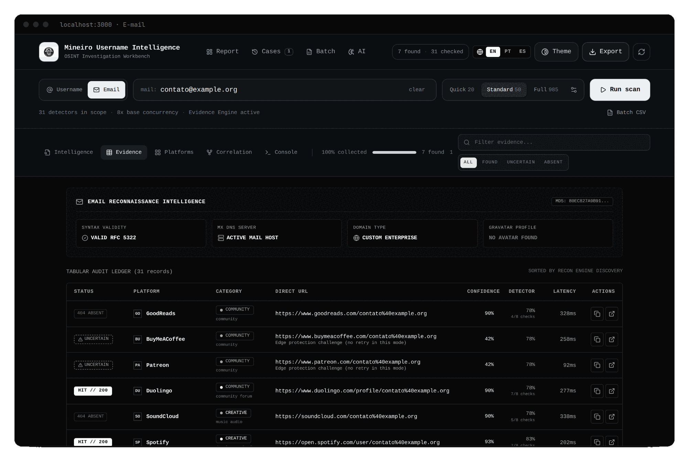
</p>

O cartão **Email reconnaissance intelligence** mostra: *Syntax validity* (RFC 5322), *MX DNS server* (host de e-mail ativo ou ausente), *Domain type* (descartável, provedor comercial ou domínio próprio), *Gravatar profile*, e um *hash MD5* parcial (o formato do Gravatar; **não** é hash de segurança).

> [!WARNING]
> **Limite importante.** Nenhum detector tem padrão de URL com `{email}`. Em plataformas `both`, o Mineiro coloca o **endereço inteiro, codificado** (`contato%40example.org`) no lugar do username. Muitos sites respondem `200` a qualquer caminho, então **os `HIT` das plataformas no modo e-mail são indícios fracos** (mesmo em Standard, como na imagem: Duolingo, Spotify). O que é confiável no modo e-mail é o **reconhecimento do endereço** (cartão). Na aba **Intelligence** o cartão não aparece; veja-o em Evidence, Platforms, Correlation ou Console.

O reconhecimento de e-mail **não** prova que a caixa existe nem a quem pertence.

---

## 10. Lote (CSV)

Para investigar vários alvos em sequência: **Batch** (cabeçalho) ou **Batch CSV** (barra de alvo), ou `Ctrl+B`.

<p align="center">
  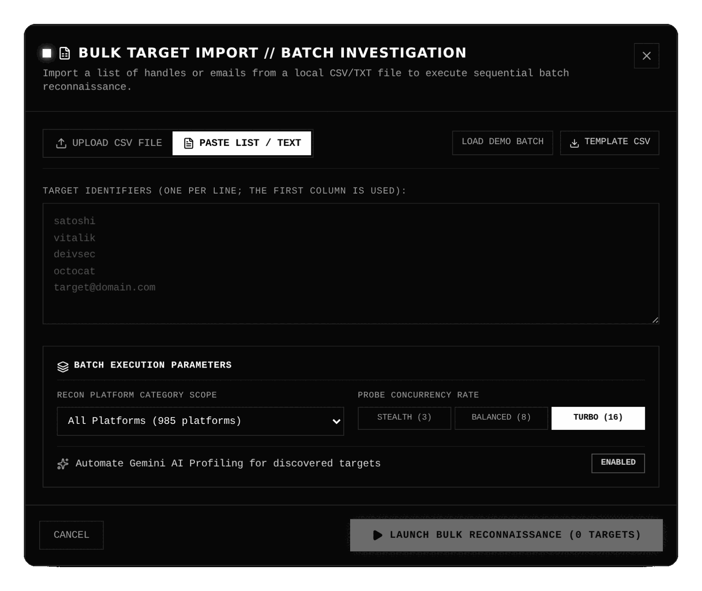
</p>

### Formato aceito

- **Uma entrada por linha.** Arquivos `.csv` ou `.txt`, enviados por clique/arrastar, ou texto colado na aba **Paste list**. Não há limite de linhas nem de tamanho.
- **Delimitador** detectado só na primeira linha: tab, `;` ou `,`.
- **Cabeçalho** reconhecido (sem distinguir maiúsculas): coluna do alvo `target`, `username`, `handle`, `identifier`, `account`, `query`, `user`, `name` (e `email` se ainda não houver alvo); tipo `type`, `targettype`, `mode`, `category`; notas `notes`, `note`, `comment`, `description`, `role`, `tag`.
- Sem cabeçalho, **só a primeira coluna** é lida.
- O `@` inicial é removido; **duplicatas** (mesmo tipo e alvo, sem distinguir maiúsculas) são removidas e contadas.
- **Tipo:** vira `email` se o valor tem formato de e-mail ou a coluna de tipo diz `email`; senão `username`.
- **Validação:** e-mail precisa ter sintaxe válida; username, 1 a 60 caracteres e sem espaço, `<`, `>`, aspas ou chaves.

Exemplo:

```csv
target,type,notes
forgejo,username,organização de código aberto
nodejs,username,projeto Node.js
rust-lang,username,
```

Botões úteis: **Load demo batch** (lote de exemplo) e **Template CSV** (baixa um modelo).

> [!WARNING]
> **Peculiaridades do importador** (documentadas porque surpreendem):
> - Uma linha `a,b,c` produz **só `a`**: use uma entrada por linha.
> - Se a **primeira linha** contiver as palavras `target`, `username` ou `email` em qualquer posição, ela é tratada como cabeçalho e descartada. Um handle chamado `myusername` na primeira linha **sumirá**. Comece sempre por uma linha de cabeçalho (`target`).
> - A tabela de prévia lista também as linhas **inválidas**, sem aviso; elas apenas ficam de fora da contagem e do lançamento.

### Execução

- Parâmetros: **escopo de categoria** e **concorrência** (*Stealth* 3 · *Balanced* 8 · *Turbo* 16). O toggle "Automate Gemini AI profiling" **não tem efeito**.
- Os alvos rodam **um por vez**, com o preset atual. No modo e-mail, o reconhecimento do endereço só roda se o preset o liga (não o Quick).
- Painel **Batch**: progresso, KPIs (Total, Hits acumulados, Sondagens, Estado do lote) e uma linha por alvo com tipo, status, hits, "Uncertain (WAF)" e notas.
- Controles: **Pausar/Retomar** e **Pular** atuam *entre ondas* de requisições (não interrompem uma onda em voo); **Abortar**; **Inspecionar** (só alvos concluídos): carrega os resultados no espaço de trabalho e abre a aba Intelligence.
- **Exportar o lote:** CSV (`mineiro_bulk_recon_batch_<id>_<data>.csv`) com `Target, Target_Type, Status, Discovered_Hits, Uncertain_WAF, Total_Platforms_Scanned, Notes, Found_Platforms, Found_URLs, Started_At, Completed_At`, e JSON.

> [!IMPORTANT]
> **O lote não é salvo.** Nem no cache, nem em casos. Recarregar a página perde a fila e os resultados. **Exporte o CSV/JSON do lote** antes de fechar, e use **Inspecionar** para levar um alvo ao relatório completo (e exportar o relatório).

---

## 11. Casos e Diff Intelligence

### O que é um caso

Um **caso** é a memória de longa duração de um alvo, guardada no **IndexedDB do seu navegador** (`mineiro_cases_v1`). Cada scan simples concluído (com pelo menos 1 plataforma e sem ser interrompido) acrescenta um **snapshot** (todos os resultados, contagens, preset, data) ao caso do mesmo alvo e tipo. Pivot scans entram no mesmo caso como pivôs.

- Limites: **40** snapshots e **40** pivôs por caso (os mais antigos são descartados).
- Não entram em casos: lotes, scans interrompidos, scans sem plataformas.
- O nome do caso é o alvo. **Não** há renomear, etiquetas ou notas na interface.

<p align="center">
  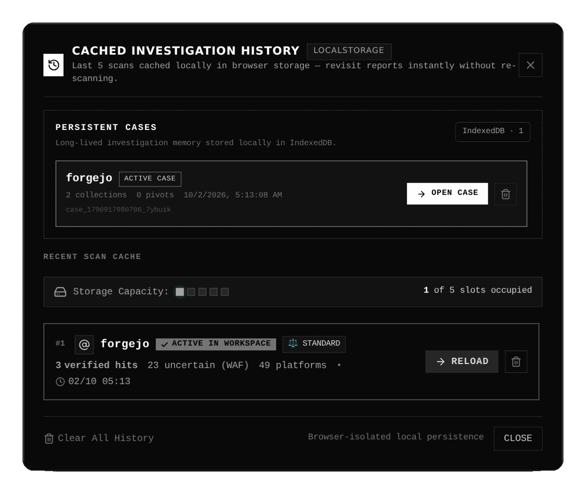
</p>

### O histórico (botão Cases, `Ctrl+H`)

| Bloco | O que é |
|---|---|
| **Persistent cases** (IndexedDB) | Lista de casos. **Open case** restaura o snapshot mais recente do alvo principal e abre a aba Correlation. A lixeira exclui (com confirmação). |
| **Recent scan cache** (localStorage) | Os **5** últimos scans, para revisitar sem refazer. **Reload** restaura os resultados. *Clear All History* apaga esse cache. |

### Diff Intelligence (Correlation → Case & Diff)

<p align="center">
  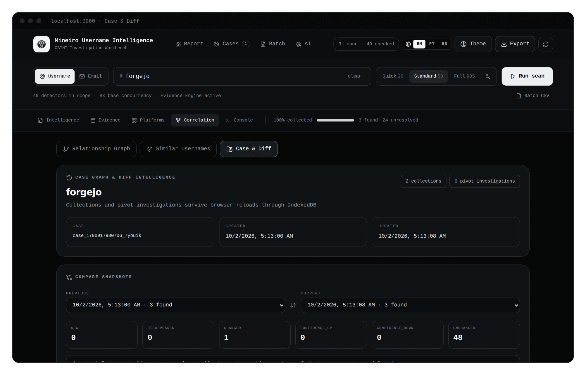
</p>

Escolha dois snapshots (**Previous** e **Current**; por padrão, o penúltimo e o último) do alvo atual. São necessárias **pelo menos 2 coletas**. O casamento é por plataforma.

| Classe | Regra |
|---|---|
| `NEW` | A plataforma só existe no snapshot novo. |
| `DISAPPEARED` | Só existe no antigo. É uma diferença **entre coletas** (escopo, bloqueio), **não** prova de que a conta foi apagada. |
| `CHANGED` | Mudou o status, a URL, o código HTTP ou os metadados. |
| `CONFIDENCE_UP` / `CONFIDENCE_DOWN` | Nada mudou, mas a confiança variou **≥ 10 pontos**. |
| `UNCHANGED` | O resto. |

**Material changes** = tudo menos `UNCHANGED`. Comparar um Quick com um Full gera muitos `NEW` simplesmente por diferença de escopo: compare scans do **mesmo preset**.

---

## 12. Pergunta de inteligência

O *requirement* muda a **prioridade analítica** dos achados, **não** os fatos observados. Está na seção 01 do relatório:

<p align="center">
  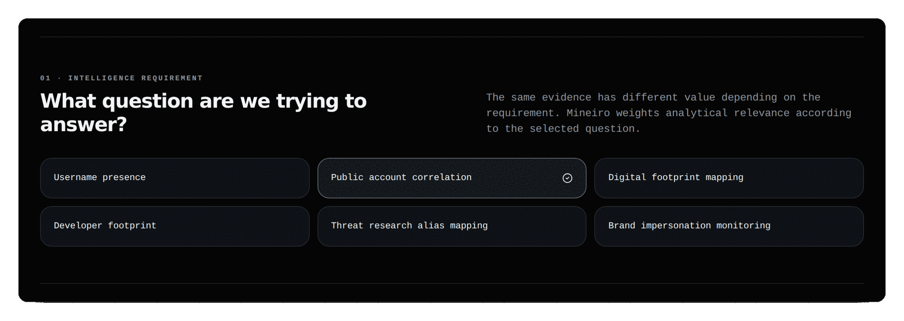
</p>

| Requisito | Use quando quer responder |
|---|---|
| **Username presence** | Onde o identificador aparece? |
| **Public account correlation** (padrão) | Quais achados têm suporte para relação entre si? |
| **Digital footprint mapping** | Em quais tipos de serviço há presença pública? |
| **Developer footprint** | Há presença técnica/dev relevante? |
| **Threat research alias mapping** | Onde um alias público aparece em superfícies relevantes para pesquisa de ameaça? |
| **Brand impersonation monitoring** | Há uso público do identificador em superfícies de marca/social? |

Como a seção 01 só existe no relatório, **o requisito é escolhido depois do scan** (a tela inicial não o oferece). Trocá-lo reordena os achados sem refazer nenhuma consulta.

---

## 13. Exportar o relatório

Abra **Export** (cabeçalho ou `Ctrl+E`). O botão só habilita com resultados.

<p align="center">
  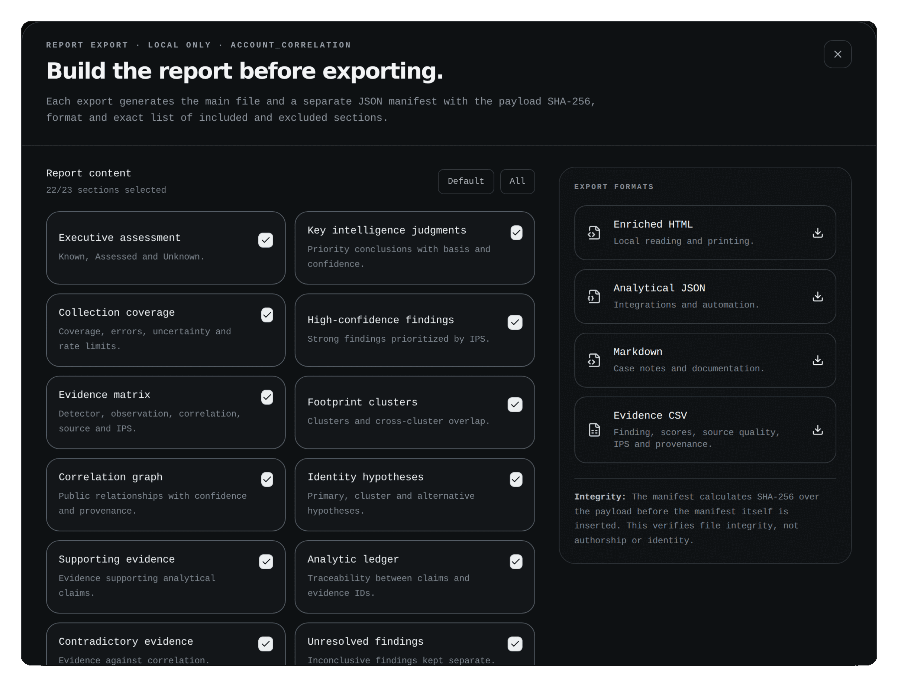
</p>

### Seções

São **23** seções selecionáveis; o padrão liga 22 (todas, **exceto** `rawResults`). Botões **Default** e **All**. Grupos: avaliação e julgamentos · coleta e evidência · análise · qualidade e método · integridade e dados brutos.

### Formatos

| Formato | Extensão | Respeita as seções? | Observação |
|---|---|:--:|---|
| **Enriched HTML** | `.html` | sim | Leitura e impressão (use *Imprimir → PDF* do navegador se quiser PDF). |
| **Analytical JSON** | `.json` | sim | Esquema `mineiro.intelligence-report.v2`. `rawResults` só existe aqui. |
| **Markdown** | `.md` | sim | Para anotações do caso. |
| **Evidence CSV** | `.csv` | **não** | Colunas: `target, evidence_id, platform, category, status, detector_confidence, observation_confidence, correlation_confidence, source_quality, ips, provenance, url`. Só `found`, `uncertain` e `rate_limited`. |

Os nomes seguem `mineiro-intelligence-<alvo>-<data-hora>.<ext>`. Chaves de JSON/CSV ficam em inglês (estáveis); o texto narrativo segue o idioma da interface.

> [!NOTE]
> **STIX 2.1 não está na interface.** Ele existe na API (`GET /api/store/export/stix`) para observações gravadas no SQLite local. Veja [CLI-E-API.md](CLI-E-API.md#512-armazenamento-apistore).

### Manifest de integridade

Cada exportação baixa **dois arquivos**: o relatório e `<mesmo-nome>.manifest.json`:

```json
{
  "schema": "mineiro.export-manifest.v1",
  "target": "forgejo",
  "intelligenceRequirement": "account_correlation",
  "format": "markdown",
  "generatedLocally": true,
  "included": ["executiveAssessment", "…"],
  "excluded": ["rawResults"],
  "payloadSha256": "e4edd0ab6b560769af477f11dbfd273a287c055fa8e79121f0a597de300144b5",
  "hashScope": "payload-before-manifest",
  "language": "en"
}
```

**Verifique** que o arquivo não foi alterado:

```bash
sha256sum mineiro-intelligence-forgejo-2026-10-02T05-15-04-716Z.md
# compare com "payloadSha256" do manifest
```

(Testamos os quatro formatos: o `sha256sum` do arquivo coincide com `payloadSha256`.) No Windows: `Get-FileHash arquivo -Algorithm SHA256`.

> [!IMPORTANT]
> O SHA-256 prova **integridade do arquivo**, não **autoria** nem **identidade**. Ele exige contexto seguro no navegador (**HTTPS ou `localhost`**); sem isso, nenhuma exportação é baixada.
>
> O hash exibido na seção 21 do relatório ("Integrity snapshot") é **outro**: é o SHA-256 de um resumo canônico dos resultados na tela, não do arquivo exportado.

### Imagens do relatório

<p align="center">
  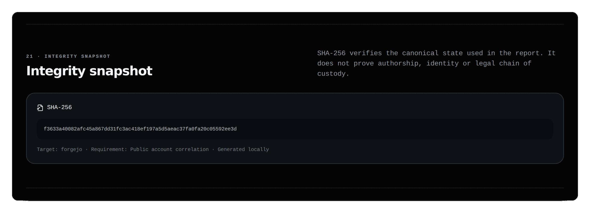
</p>

---

## 14. Copiloto de IA

Opcional. **Todo o relatório determinístico funciona sem IA.** Abra **AI** (cabeçalho) ou o painel ao final do relatório.

<p align="center">
  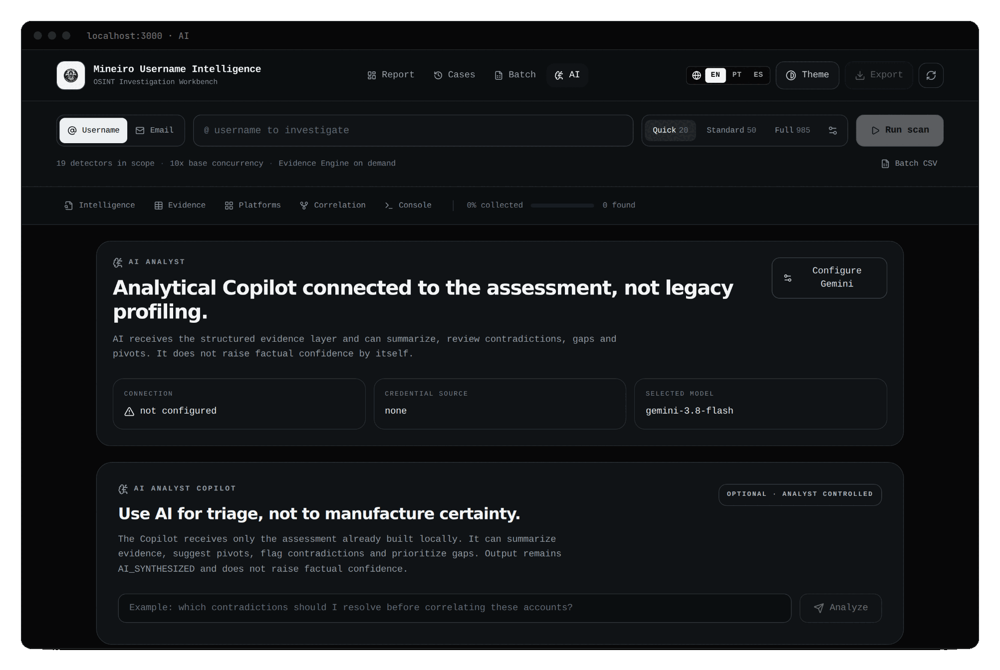
</p>

### Configurar a chave do Gemini

<p align="center">
  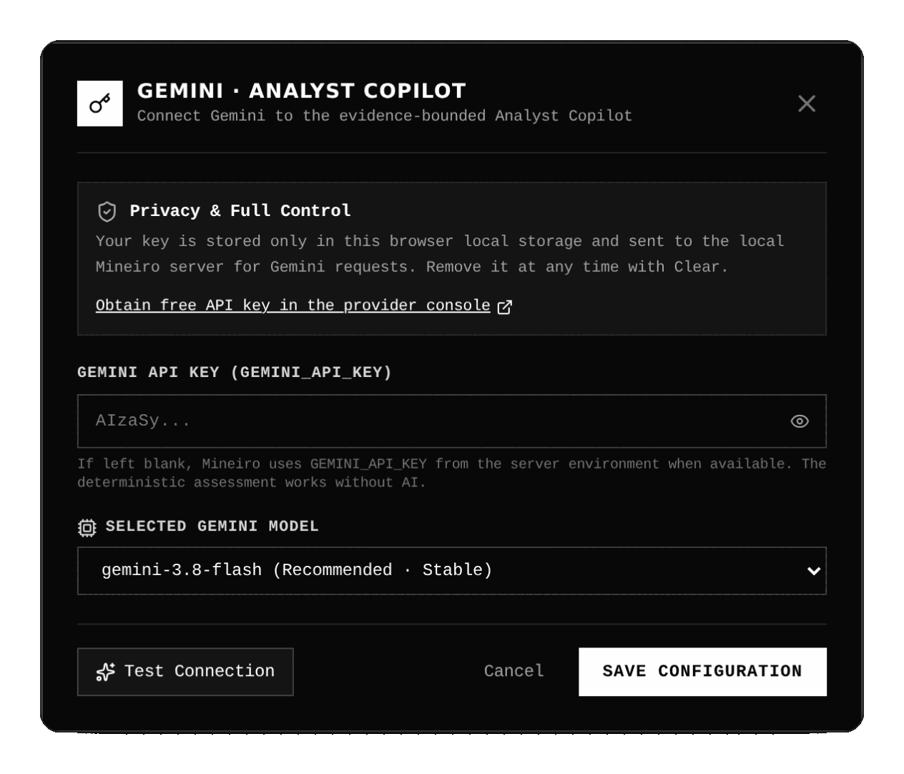
</p>

1. **AI → Configure Gemini**.
2. Cole sua chave (obtida no Google AI Studio) e escolha o modelo (`gemini-3.8-flash` é o padrão).
3. **Test connection** valida chave e modelo. **Save** guarda. **Clear** remove na hora.

Sem chave pessoal, o servidor tenta a variável `GEMINI_API_KEY` do ambiente (a menos que seja uma instância pública).

> [!CAUTION]
> A chave fica no **`localStorage` do navegador, em texto puro**, e viaja ao seu servidor local no cabeçalho `x-gemini-api-key` a cada chamada. Não a configure em computador compartilhado. Detalhes em [PRIVACIDADE-E-DADOS.md](PRIVACIDADE-E-DADOS.md#3-o-que-sai-da-sua-máquina).

### O que o copiloto recebe e devolve

- **Recebe** (envia ao Google): um resumo com avaliação, julgamentos, clusters, hipóteses, contradições, lacunas, pivôs e as **30 evidências de maior IPS** (plataforma, categoria, **URL com o identificador pesquisado**, status, sinais, confianças). Não enviam: grafo, linha do tempo, ledger, apêndice técnico, nem o rótulo do alvo.
- **Devolve** um resumo executivo, contradições a resolver, lacunas (com importância), pivôs recomendados (com prioridade), hipóteses alternativas e um aviso de confiança, sempre marcado `AI_SYNTHESIZED` com `factualConfidenceRaised: false`.
- O painel **mostra** o resumo, contradições, lacunas e pivôs; não exibe `alternativeHypotheses`, `confidenceCaveat` nem `priorityEvidenceIds`.
- IDs de evidência inventados pelo modelo são **descartados** antes de chegar a você.
- Pergunte algo específico no campo ("quais contradições devo resolver antes de correlacionar estas contas?") e clique em **Analyze**.

Erros e limites: [TROUBLESHOOTING.md](TROUBLESHOOTING.md#e-copiloto-de-ia-gemini).

---

## 15. Idioma, tema e atalhos

### Idioma

**EN · PT · ES** no cabeçalho (menu suspenso em telas pequenas). O padrão é **português**. Afeta a interface, o relatório, os julgamentos e as exportações narrativas. Chaves estruturais de JSON/CSV permanecem estáveis. Alguns textos de telas secundárias (por exemplo, partes do modal de configuração avançada e do lote) estão **apenas em inglês**.

### Tema

O botão **Theme** cicla `dark → bone → high-contrast`. Na primeira visita, o alto contraste é escolhido se o sistema operacional pede mais contraste. Hoje **só o alto contraste altera visualmente a interface**: `bone` e `dark` são praticamente idênticos.

### Atalhos

<p align="center">
  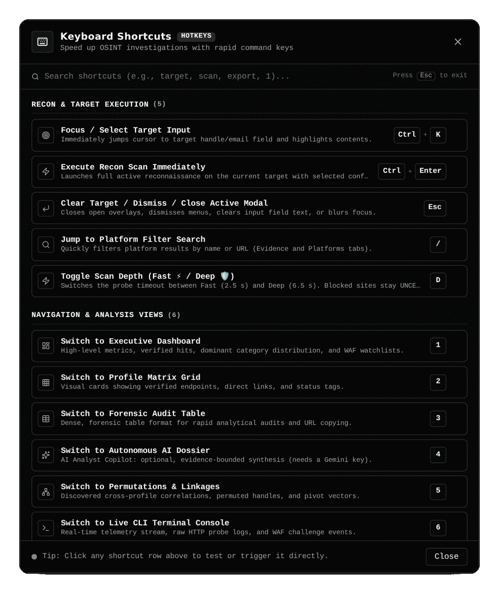
</p>

| Tecla | Ação |
|---|---|
| `Ctrl/⌘ + K` | Foca o campo de alvo da **barra do topo** |
| `Ctrl/⌘ + Enter` | Executa o scan (se houver alvo e nenhum scan em andamento) |
| `Esc` | Fecha o modal aberto; senão limpa o alvo/filtro ou tira o foco |
| `/` | Foca o filtro (só nas abas Evidence e Platforms) |
| `?` | Abre/fecha a lista de atalhos |
| `D` | Alterna Fast ↔ Deep |
| `1`–`7` | Troca de visão ([tabela completa na Cheatsheet](CHEATSHEET.md#atalhos-de-teclado)) |
| `Ctrl/⌘ + E / B / H / M` | Export · Batch · Cases (histórico) · Configuração avançada |

---

## 16. Quando parar

Pare de ampliar a coleta quando novos dados **não**:

- alterarem os julgamentos;
- resolverem contradições;
- fecharem lacunas;
- mudarem materialmente a decisão analítica.

Essa regra vale mais do que transformar 985 detectores em ritual. Roteiros prontos: [RECEITAS.md](RECEITAS.md).

---

## 17. Comportamentos e limites conhecidos da interface

Esta seção existe para você **não ser surpreendido**. Cada item está no [plano de melhorias](PLANO-PAGINA-INICIAL.md) ou será corrigido.

| # | Comportamento | Como lidar |
|---|---|---|
| 1 | Contagens "20 / 50 / 985" são arredondadas (reais: 19 / 49 / 984 em modo usuário). | Use os números da [Cheatsheet](CHEATSHEET.md#presets-de-scan). |
| 2 | Os cartões do modal avançado mostram valores que não são os reais (por exemplo, "Turbo 16x" no Quick, que usa concorrência 10; "Auto AI"). | Confie na tabela [§3](#3-escolher-a-profundidade). |
| 3 | O modal avançado guarda estado antigo entre aberturas. | Recarregue antes de editar. |
| 4 | Modo e-mail: o Quick não faz o reconhecimento do endereço; os `HIT` de plataformas são fracos. | Use Standard e leia o cartão ([§9](#9-modo-e-mail)). |
| 5 | O lote não é persistido. | Exporte CSV/JSON do lote. |
| 6 | Alguns metadados (nome de exibição, organização, domínios) **não são capturados** pelos scans; por isso o grafo real se limita a alvo → handle → perfis → plataformas, mais candidatos e pivôs. | Não espere nós de organização/domínio. |
| 7 | O Dashboard e a área AI não têm aba. | Teclas `1` e `4`, ou o botão **AI**. |
| 8 | Cada pivot scan ocupa um dos 5 lugares do cache e pode expulsar scans anteriores. | Os casos (IndexedDB) não são afetados. |
| 9 | Falha de um pivot scan pode não exibir mensagem. | Veja o Console. |
| 10 | O Quick usa o motor mais simples. | Prefira Standard para qualquer decisão. |

Para cada novo comportamento estranho, abra uma issue seguindo [TROUBLESHOOTING.md](TROUBLESHOOTING.md#como-abrir-uma-issue-útil).
